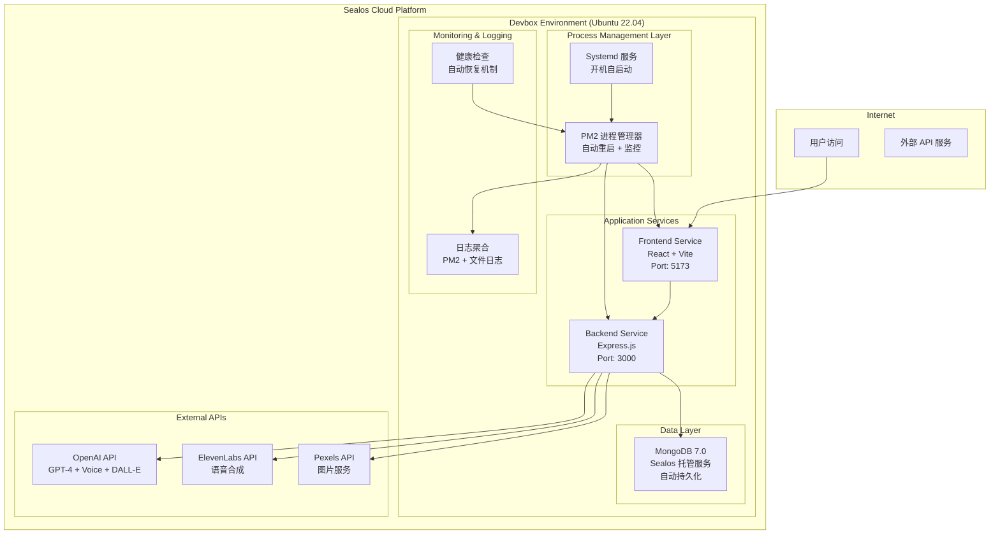

# 持续服务部署设计文档

## 概述

本设计文档描述了如何在 Sealos devbox 环境中实现 WordPecker 应用的持续运行，确保服务不依赖开发电脑的连接状态。基于现有的 Docker Compose 和 PM2 配置，我们将创建一个完全自动化的云端部署方案，实现真正的 24/7 服务可用性。

### 核心设计目标

1. **云端独立运行**: 服务完全在 Sealos devbox 中运行，不依赖开发电脑连接状态
2. **自动故障恢复**: 实现多层次的自动重启和故障恢复机制
3. **全面监控体系**: 提供实时监控、健康检查和告警功能
4. **远程管理能力**: 支持远程部署、重启和日志查看
5. **高可用保障**: 确保服务连续性和业务不中断

## 架构设计

### 整体架构图



### 服务持续运行策略

1. **多层保障机制** (对应需求 1)
   - **Systemd 服务层**: 系统级服务管理，确保开机自启动和系统重启后自动恢复
   - **PM2 进程管理层**: 应用级进程管理，自动重启和实时监控
   - **健康检查层**: 定期检查服务状态，异常时自动恢复和告警

2. **独立运行环境** (对应需求 1)
   - 所有服务运行在 Sealos devbox 云环境中，完全脱离开发电脑依赖
   - 网络连接中断时自动重连机制
   - 使用云端 MongoDB 服务确保数据持久化和高可用

3. **远程管理体系** (对应需求 3)
   - 基于 Web 的服务状态监控界面
   - 远程重启和服务管理 API
   - 自动化部署和代码更新流程
   - 远程日志查看和下载功能

4. **高可用架构** (对应需求 4)
   - 服务实例自动故障切换
   - 数据库连接池和自动重连
   - 负载监控和自动扩容机制
   - 系统资源保护和告警

## 组件和接口

### 1. 进程管理组件 (Process Management)

**PM2 配置增强**
```javascript
// ecosystem.config.js 增强版
module.exports = {
  apps: [
    {
      name: 'wordpecker-backend',
      script: 'npm',
      args: 'start',
      cwd: './backend',
      instances: 1,
      exec_mode: 'fork',
      
      // 生产环境配置
      env: {
        NODE_ENV: 'production',
        PORT: 3000
      },
      
      // 自动重启和监控
      autorestart: true,
      watch: false,
      max_memory_restart: '500M',
      min_uptime: '10s',
      max_restarts: 10,
      restart_delay: 4000,
      
      // 健康检查
      health_check_grace_period: 3000,
      
      // 日志管理
      log_file: './logs/pm2-backend-combined.log',
      out_file: './logs/pm2-backend-out.log',
      error_file: './logs/pm2-backend-error.log',
      log_date_format: 'YYYY-MM-DD HH:mm:ss Z',
      merge_logs: true,
      
      // 进程保活
      kill_timeout: 5000,
      listen_timeout: 3000
    },
    
    {
      name: 'wordpecker-frontend',
      script: 'npm',
      args: 'run preview -- --host 0.0.0.0 --port 5173',
      cwd: './frontend',
      instances: 1,
      exec_mode: 'fork',
      
      // 生产环境配置
      env: {
        NODE_ENV: 'production',
        PORT: 5173,
        VITE_API_URL: 'http://localhost:3000'
      },
      
      // 自动重启配置
      autorestart: true,
      watch: false,
      max_memory_restart: '300M',
      min_uptime: '10s',
      max_restarts: 5,
      restart_delay: 4000,
      
      // 日志管理
      log_file: './logs/pm2-frontend-combined.log',
      out_file: './logs/pm2-frontend-out.log',
      error_file: './logs/pm2-frontend-error.log',
      log_date_format: 'YYYY-MM-DD HH:mm:ss Z',
      merge_logs: true
    }
  ]
};
```

**Systemd 服务配置**
```ini
# /etc/systemd/system/wordpecker.service
[Unit]
Description=WordPecker Application
After=network.target
Wants=network.target

[Service]
Type=forking
User=devbox
WorkingDirectory=/home/devbox/wordpecker-app
ExecStart=/usr/local/bin/pm2 start ecosystem.config.js --env production
ExecReload=/usr/local/bin/pm2 reload ecosystem.config.js --env production
ExecStop=/usr/local/bin/pm2 stop ecosystem.config.js
PIDFile=/home/devbox/.pm2/pm2.pid
Restart=always
RestartSec=10

[Install]
WantedBy=multi-user.target
```

### 2. 健康检查和监控组件 (Health Check & Monitoring)

**设计理念**: 实现全方位的服务监控体系，满足需求 2 中的监控和告警要求

**后端健康检查端点**
```typescript
// backend/src/api/health.ts
import { Router } from 'express';
import mongoose from 'mongoose';

const router = Router();

// 基础健康检查
router.get('/health', (req, res) => {
  res.json({
    status: 'healthy',
    timestamp: new Date().toISOString(),
    uptime: process.uptime(),
    memory: process.memoryUsage(),
    version: process.env.npm_package_version
  });
});

// 详细就绪检查
router.get('/ready', async (req, res) => {
  try {
    // 检查数据库连接
    const dbStatus = mongoose.connection.readyState === 1 ? 'connected' : 'disconnected';
    
    // 检查外部 API 连接
    const apiChecks = {
      openai: process.env.OPENAI_API_KEY ? 'configured' : 'missing',
      elevenlabs: process.env.ELEVENLABS_API_KEY ? 'configured' : 'optional',
      pexels: process.env.PEXELS_API_KEY ? 'configured' : 'optional'
    };
    
    const isReady = dbStatus === 'connected' && apiChecks.openai === 'configured';
    
    res.status(isReady ? 200 : 503).json({
      status: isReady ? 'ready' : 'not_ready',
      database: dbStatus,
      apis: apiChecks,
      timestamp: new Date().toISOString()
    });
  } catch (error) {
    res.status(503).json({
      status: 'error',
      error: error.message,
      timestamp: new Date().toISOString()
    });
  }
});

export default router;
```

**健康检查脚本**
```bash
#!/bin/bash
# scripts/health-check.sh

BACKEND_URL="http://localhost:3000"
FRONTEND_URL="http://localhost:5173"
LOG_FILE="./logs/health-check.log"

# 创建日志目录
mkdir -p ./logs

# 检查后端服务
check_backend() {
    local response=$(curl -s -o /dev/null -w "%{http_code}" "$BACKEND_URL/api/health")
    if [ "$response" = "200" ]; then
        echo "$(date): Backend service is healthy" >> "$LOG_FILE"
        return 0
    else
        echo "$(date): Backend service is unhealthy (HTTP $response)" >> "$LOG_FILE"
        return 1
    fi
}

# 检查前端服务
check_frontend() {
    local response=$(curl -s -o /dev/null -w "%{http_code}" "$FRONTEND_URL")
    if [ "$response" = "200" ]; then
        echo "$(date): Frontend service is healthy" >> "$LOG_FILE"
        return 0
    else
        echo "$(date): Frontend service is unhealthy (HTTP $response)" >> "$LOG_FILE"
        return 1
    fi
}

# 重启服务
restart_service() {
    local service_name=$1
    echo "$(date): Restarting $service_name" >> "$LOG_FILE"
    pm2 restart "$service_name"
    sleep 10
}

# 主检查逻辑
main() {
    if ! check_backend; then
        restart_service "wordpecker-backend"
    fi
    
    if ! check_frontend; then
        restart_service "wordpecker-frontend"
    fi
}

main
```

### 3. 远程管理和自动化部署组件 (Remote Management & Automated Deployment)

**设计理念**: 实现需求 3 和需求 5 中的远程管理和自动化部署功能

**远程管理 API 端点**
```typescript
// backend/src/api/management/routes.ts
import { Router } from 'express';
import { exec } from 'child_process';
import { promisify } from 'util';

const router = Router();
const execAsync = promisify(exec);

// 远程重启服务
router.post('/restart/:service', async (req, res) => {
  try {
    const { service } = req.params;
    const validServices = ['wordpecker-backend', 'wordpecker-frontend', 'all'];
    
    if (!validServices.includes(service)) {
      return res.status(400).json({ error: 'Invalid service name' });
    }
    
    const command = service === 'all' ? 'pm2 restart all' : `pm2 restart ${service}`;
    await execAsync(command);
    
    res.json({ 
      success: true, 
      message: `Service ${service} restarted successfully`,
      timestamp: new Date().toISOString()
    });
  } catch (error) {
    res.status(500).json({ error: error.message });
  }
});

// 获取服务状态
router.get('/status', async (req, res) => {
  try {
    const { stdout } = await execAsync('pm2 jlist');
    const processes = JSON.parse(stdout);
    
    const status = processes.map(proc => ({
      name: proc.name,
      status: proc.pm2_env.status,
      uptime: proc.pm2_env.pm_uptime,
      memory: proc.monit.memory,
      cpu: proc.monit.cpu,
      restarts: proc.pm2_env.restart_time
    }));
    
    res.json({ success: true, data: status });
  } catch (error) {
    res.status(500).json({ error: error.message });
  }
});

// 获取日志
router.get('/logs/:service', async (req, res) => {
  try {
    const { service } = req.params;
    const { lines = 100 } = req.query;
    
    const { stdout } = await execAsync(`pm2 logs ${service} --lines ${lines} --nostream`);
    
    res.json({ 
      success: true, 
      data: stdout,
      timestamp: new Date().toISOString()
    });
  } catch (error) {
    res.status(500).json({ error: error.message });
  }
});

export default router;
```

**部署脚本**
```bash
#!/bin/bash
# scripts/deploy.sh

set -e

PROJECT_DIR="/home/devbox/wordpecker-app"
BACKUP_DIR="/home/devbox/backups"
LOG_FILE="./logs/deploy.log"

# 创建必要目录
mkdir -p "$BACKUP_DIR" "./logs"

# 记录部署开始
echo "$(date): Starting deployment" >> "$LOG_FILE"

# 备份当前版本
backup_current() {
    local backup_name="wordpecker-$(date +%Y%m%d-%H%M%S)"
    echo "$(date): Creating backup: $backup_name" >> "$LOG_FILE"
    
    cp -r "$PROJECT_DIR" "$BACKUP_DIR/$backup_name"
    
    # 保留最近5个备份
    cd "$BACKUP_DIR"
    ls -t | tail -n +6 | xargs -r rm -rf
}

# 更新代码
update_code() {
    echo "$(date): Updating code from repository" >> "$LOG_FILE"
    cd "$PROJECT_DIR"
    
    # 拉取最新代码
    git fetch origin
    git reset --hard origin/main
    
    # 安装依赖
    cd backend && npm ci --production
    cd ../frontend && npm ci && npm run build
}

# 重启服务
restart_services() {
    echo "$(date): Restarting services" >> "$LOG_FILE"
    
    # 重启 PM2 管理的服务
    pm2 reload ecosystem.config.js --env production
    
    # 等待服务启动
    sleep 15
    
    # 验证服务状态
    if curl -f http://localhost:3000/api/health > /dev/null 2>&1; then
        echo "$(date): Deployment successful" >> "$LOG_FILE"
    else
        echo "$(date): Deployment failed, rolling back" >> "$LOG_FILE"
        rollback_deployment
        exit 1
    fi
}

# 回滚部署
rollback_deployment() {
    echo "$(date): Rolling back deployment" >> "$LOG_FILE"
    
    # 获取最新备份
    local latest_backup=$(ls -t "$BACKUP_DIR" | head -n 1)
    
    if [ -n "$latest_backup" ]; then
        rm -rf "$PROJECT_DIR"
        cp -r "$BACKUP_DIR/$latest_backup" "$PROJECT_DIR"
        pm2 reload ecosystem.config.js --env production
        echo "$(date): Rollback completed" >> "$LOG_FILE"
    fi
}

# 主部署流程
main() {
    backup_current
    update_code
    restart_services
}

main
```

### 4. 高可用性和负载管理组件 (High Availability & Load Management)

**设计理念**: 实现需求 4 中的高可用性和自动扩容功能

**负载监控和自动扩容**
```typescript
// backend/src/services/loadBalancer.ts
import { logger } from '../config/logger';
import { exec } from 'child_process';
import { promisify } from 'util';

const execAsync = promisify(exec);

export class LoadBalancer {
  private readonly CPU_THRESHOLD = 80;
  private readonly MEMORY_THRESHOLD = 80;
  private readonly MAX_INSTANCES = 3;
  
  async monitorAndScale() {
    try {
      const metrics = await this.getSystemMetrics();
      
      if (metrics.cpu > this.CPU_THRESHOLD || metrics.memory > this.MEMORY_THRESHOLD) {
        await this.scaleUp();
      } else if (metrics.cpu < 30 && metrics.memory < 30) {
        await this.scaleDown();
      }
    } catch (error) {
      logger.error('Load balancing error:', error);
    }
  }
  
  private async getSystemMetrics() {
    const { stdout: cpuInfo } = await execAsync("top -bn1 | grep 'Cpu(s)' | awk '{print $2}' | awk -F'%' '{print $1}'");
    const { stdout: memInfo } = await execAsync("free | grep Mem | awk '{printf(\"%.1f\", $3/$2 * 100.0)}'");
    
    return {
      cpu: parseFloat(cpuInfo.trim()),
      memory: parseFloat(memInfo.trim())
    };
  }
  
  private async scaleUp() {
    const { stdout } = await execAsync('pm2 list | grep wordpecker-backend | wc -l');
    const currentInstances = parseInt(stdout.trim());
    
    if (currentInstances < this.MAX_INSTANCES) {
      await execAsync('pm2 scale wordpecker-backend +1');
      logger.info(`Scaled up backend to ${currentInstances + 1} instances`);
    }
  }
  
  private async scaleDown() {
    const { stdout } = await execAsync('pm2 list | grep wordpecker-backend | wc -l');
    const currentInstances = parseInt(stdout.trim());
    
    if (currentInstances > 1) {
      await execAsync('pm2 scale wordpecker-backend -1');
      logger.info(`Scaled down backend to ${currentInstances - 1} instances`);
    }
  }
}
```

**服务实例故障切换**
```typescript
// backend/src/services/failoverManager.ts
export class FailoverManager {
  private healthCheckInterval: NodeJS.Timeout;
  
  constructor() {
    this.startHealthChecks();
  }
  
  private startHealthChecks() {
    this.healthCheckInterval = setInterval(async () => {
      await this.checkServiceHealth();
    }, 30000); // 每30秒检查一次
  }
  
  private async checkServiceHealth() {
    try {
      const { stdout } = await execAsync('pm2 jlist');
      const processes = JSON.parse(stdout);
      
      for (const proc of processes) {
        if (proc.pm2_env.status === 'errored' || proc.pm2_env.status === 'stopped') {
          logger.warn(`Service ${proc.name} is ${proc.pm2_env.status}, attempting restart`);
          await execAsync(`pm2 restart ${proc.name}`);
        }
      }
    } catch (error) {
      logger.error('Health check failed:', error);
    }
  }
}
```

### 5. 监控和日志组件 (Monitoring & Logging)

**日志聚合配置**
```javascript
// backend/src/config/logger.ts
import winston from 'winston';
import path from 'path';

const logDir = path.join(process.cwd(), '../logs');

export const logger = winston.createLogger({
  level: process.env.LOG_LEVEL || 'info',
  format: winston.format.combine(
    winston.format.timestamp(),
    winston.format.errors({ stack: true }),
    winston.format.json()
  ),
  defaultMeta: { service: 'wordpecker-backend' },
  transports: [
    // 错误日志
    new winston.transports.File({
      filename: path.join(logDir, 'error.log'),
      level: 'error',
      maxsize: 10485760, // 10MB
      maxFiles: 5
    }),
    
    // 综合日志
    new winston.transports.File({
      filename: path.join(logDir, 'combined.log'),
      maxsize: 10485760, // 10MB
      maxFiles: 5
    }),
    
    // 控制台输出
    new winston.transports.Console({
      format: winston.format.combine(
        winston.format.colorize(),
        winston.format.simple()
      )
    })
  ]
});
```

**监控脚本**
```bash
#!/bin/bash
# scripts/monitor.sh

MONITOR_INTERVAL=60  # 60秒检查一次
LOG_FILE="./logs/monitor.log"

# 监控系统资源
monitor_resources() {
    local cpu_usage=$(top -bn1 | grep "Cpu(s)" | awk '{print $2}' | awk -F'%' '{print $1}')
    local memory_usage=$(free | grep Mem | awk '{printf("%.1f", $3/$2 * 100.0)}')
    local disk_usage=$(df -h / | awk 'NR==2{printf "%s", $5}')
    
    echo "$(date): CPU: ${cpu_usage}%, Memory: ${memory_usage}%, Disk: ${disk_usage}" >> "$LOG_FILE"
    
    # 资源使用率告警
    if (( $(echo "$cpu_usage > 80" | bc -l) )); then
        echo "$(date): WARNING: High CPU usage: ${cpu_usage}%" >> "$LOG_FILE"
    fi
    
    if (( $(echo "$memory_usage > 80" | bc -l) )); then
        echo "$(date): WARNING: High memory usage: ${memory_usage}%" >> "$LOG_FILE"
    fi
}

# 监控 PM2 进程
monitor_pm2() {
    local pm2_status=$(pm2 jlist | jq -r '.[] | "\(.name): \(.pm2_env.status)"')
    echo "$(date): PM2 Status: $pm2_status" >> "$LOG_FILE"
    
    # 检查是否有停止的进程
    if echo "$pm2_status" | grep -q "stopped"; then
        echo "$(date): WARNING: Some PM2 processes are stopped" >> "$LOG_FILE"
        pm2 restart all
    fi
}

# 主监控循环
main() {
    while true; do
        monitor_resources
        monitor_pm2
        sleep "$MONITOR_INTERVAL"
    done
}

main
```

## 数据模型

### 部署配置模型 (对应需求 5 - 自动化部署)

```typescript
interface PersistentDeploymentConfig {
  // 服务配置
  services: {
    backend: {
      port: number;
      instances: number;
      memory_limit: string;
      restart_policy: 'always' | 'on-failure' | 'unless-stopped';
    };
    frontend: {
      port: number;
      build_command: string;
      serve_command: string;
    };
  };
  
  // 数据库配置
  database: {
    url: string;
    connection_pool_size: number;
    retry_attempts: number;
    retry_delay: number;
  };
  
  // 监控配置
  monitoring: {
    health_check_interval: number;
    log_retention_days: number;
    alert_thresholds: {
      cpu_percent: number;
      memory_percent: number;
      disk_percent: number;
    };
  };
  
  // 部署配置
  deployment: {
    auto_deploy: boolean;
    backup_retention: number;
    rollback_enabled: boolean;
  };
}
```

### 服务状态模型 (对应需求 2 - 监控和状态管理)

```typescript
interface ServiceStatus {
  name: string;
  status: 'running' | 'stopped' | 'error' | 'restarting';
  uptime: number;
  memory_usage: number;
  cpu_usage: number;
  restart_count: number;
  last_restart: Date;
  health_check: {
    status: 'healthy' | 'unhealthy' | 'unknown';
    last_check: Date;
    response_time: number;
  };
}

### 远程管理接口模型 (对应需求 3 - 远程管理)

```typescript
interface RemoteManagementAPI {
  // 服务控制接口
  serviceControl: {
    restart: (serviceName: string) => Promise<OperationResult>;
    stop: (serviceName: string) => Promise<OperationResult>;
    start: (serviceName: string) => Promise<OperationResult>;
    scale: (serviceName: string, instances: number) => Promise<OperationResult>;
  };
  
  // 状态查询接口
  statusQuery: {
    getServiceStatus: () => Promise<ServiceStatus[]>;
    getSystemMetrics: () => Promise<SystemMetrics>;
    getHealthStatus: () => Promise<HealthStatus>;
  };
  
  // 日志管理接口
  logManagement: {
    getLogs: (serviceName: string, lines?: number) => Promise<string>;
    downloadLogs: (serviceName: string, dateRange?: DateRange) => Promise<Buffer>;
    clearLogs: (serviceName: string) => Promise<OperationResult>;
  };
  
  // 部署管理接口
  deploymentManagement: {
    deploy: (version?: string) => Promise<DeploymentResult>;
    rollback: (version: string) => Promise<DeploymentResult>;
    getDeploymentHistory: () => Promise<DeploymentHistory[]>;
  };
}

interface OperationResult {
  success: boolean;
  message: string;
  timestamp: Date;
  details?: any;
}

interface SystemMetrics {
  cpu: {
    usage: number;
    cores: number;
  };
  memory: {
    used: number;
    total: number;
    percentage: number;
  };
  disk: {
    used: number;
    total: number;
    percentage: number;
  };
  network: {
    bytesIn: number;
    bytesOut: number;
  };
}
```
```

## 设计决策和理由

### 1. 多层保障架构选择
**决策**: 采用 Systemd + PM2 + 健康检查的三层保障机制
**理由**: 
- Systemd 确保系统级别的服务管理和开机自启动（满足需求 1.4）
- PM2 提供应用级别的进程管理和自动重启（满足需求 1.3）
- 健康检查层提供业务级别的状态监控和恢复（满足需求 2.1, 2.2）

### 2. 云端独立运行设计
**决策**: 完全基于 Sealos devbox 环境，不依赖外部开发环境
**理由**:
- 满足需求 1.1 - 开发电脑关闭后服务继续运行
- 使用云端 MongoDB 服务确保数据持久化
- 所有脚本和配置都部署在云端，实现真正的独立运行

### 3. 远程管理 API 设计
**决策**: 基于 REST API 的远程管理接口
**理由**:
- 满足需求 3 的所有远程管理要求
- 提供标准化的 HTTP 接口，便于集成和扩展
- 支持服务重启、日志查看、状态监控等核心功能

### 4. 自动化部署流程设计
**决策**: Git-based 自动化部署 + 备份回滚机制
**理由**:
- 满足需求 5 的自动化部署要求
- 备份机制确保部署失败时可以快速回滚
- 预部署和后部署验证确保部署质量

### 5. 高可用性架构选择
**决策**: 基于 PM2 的多实例 + 自动扩容机制
**理由**:
- 满足需求 4 的高可用性要求
- PM2 cluster 模式支持多实例负载均衡
- 自动扩容机制应对负载变化

## 错误处理

### 1. 服务异常处理

**自动重启策略**
```typescript
// PM2 配置中的错误处理
const errorHandlingConfig = {
  // 最大重启次数
  max_restarts: 10,
  
  // 重启延迟（指数退避）
  restart_delay: 4000,
  
  // 最小运行时间（避免快速重启循环）
  min_uptime: '10s',
  
  // 内存限制重启
  max_memory_restart: '500M',
  
  // 进程终止超时
  kill_timeout: 5000
};
```

**数据库连接错误处理**
```typescript
// backend/src/config/database.ts
import mongoose from 'mongoose';
import { logger } from './logger';

const connectWithRetry = async (retries = 5, delay = 5000) => {
  try {
    await mongoose.connect(process.env.MONGODB_URL!, {
      maxPoolSize: 10,
      serverSelectionTimeoutMS: 5000,
      socketTimeoutMS: 45000,
    });
    
    logger.info('MongoDB connected successfully');
  } catch (error) {
    logger.error(`MongoDB connection failed: ${error.message}`);
    
    if (retries > 0) {
      logger.info(`Retrying connection in ${delay}ms... (${retries} attempts left)`);
      setTimeout(() => connectWithRetry(retries - 1, delay * 2), delay);
    } else {
      logger.error('Max retries reached. Exiting...');
      process.exit(1);
    }
  }
};

// 连接事件处理
mongoose.connection.on('disconnected', () => {
  logger.warn('MongoDB disconnected. Attempting to reconnect...');
  connectWithRetry();
});

mongoose.connection.on('error', (error) => {
  logger.error(`MongoDB error: ${error.message}`);
});

export { connectWithRetry };
```

### 2. 外部 API 错误处理

**API 调用重试机制**
```typescript
// backend/src/services/apiClient.ts
import axios, { AxiosRequestConfig } from 'axios';
import { logger } from '../config/logger';

class APIClient {
  private async makeRequest<T>(
    config: AxiosRequestConfig,
    retries = 3,
    delay = 1000
  ): Promise<T> {
    try {
      const response = await axios(config);
      return response.data;
    } catch (error) {
      logger.error(`API request failed: ${error.message}`);
      
      if (retries > 0 && this.isRetryableError(error)) {
        logger.info(`Retrying request in ${delay}ms... (${retries} attempts left)`);
        await new Promise(resolve => setTimeout(resolve, delay));
        return this.makeRequest<T>(config, retries - 1, delay * 2);
      }
      
      throw error;
    }
  }
  
  private isRetryableError(error: any): boolean {
    return (
      error.code === 'ECONNRESET' ||
      error.code === 'ETIMEDOUT' ||
      (error.response && error.response.status >= 500)
    );
  }
}
```

### 3. 系统资源错误处理

**资源监控和保护**
```bash
#!/bin/bash
# scripts/resource-protection.sh

# 内存使用率检查
check_memory() {
    local memory_usage=$(free | grep Mem | awk '{printf("%.1f", $3/$2 * 100.0)}')
    
    if (( $(echo "$memory_usage > 90" | bc -l) )); then
        echo "$(date): CRITICAL: Memory usage at ${memory_usage}%" >> ./logs/resource.log
        
        # 重启内存使用最高的服务
        pm2 restart wordpecker-backend
        
        # 清理临时文件
        find ./audio-cache -type f -mtime +1 -delete
        find ./logs -name "*.log" -mtime +7 -delete
    fi
}

# 磁盘空间检查
check_disk() {
    local disk_usage=$(df -h / | awk 'NR==2{print $5}' | sed 's/%//')
    
    if [ "$disk_usage" -gt 85 ]; then
        echo "$(date): WARNING: Disk usage at ${disk_usage}%" >> ./logs/resource.log
        
        # 清理旧日志和缓存
        find ./logs -name "*.log" -mtime +3 -delete
        find ./audio-cache -type f -mtime +1 -delete
        
        # 清理 PM2 日志
        pm2 flush
    fi
}
```

## 测试策略

### 1. 部署前测试

**自动化测试脚本**
```bash
#!/bin/bash
# scripts/pre-deploy-test.sh

set -e

echo "Running pre-deployment tests..."

# 环境变量检查
test_environment() {
    echo "Testing environment variables..."
    
    if [ -z "$OPENAI_API_KEY" ]; then
        echo "ERROR: OPENAI_API_KEY is not set"
        exit 1
    fi
    
    if [ -z "$MONGODB_URL" ]; then
        echo "ERROR: MONGODB_URL is not set"
        exit 1
    fi
    
    echo "Environment variables OK"
}

# 依赖检查
test_dependencies() {
    echo "Testing dependencies..."
    
    # 检查 Node.js 版本
    node_version=$(node -v | cut -d'v' -f2)
    if ! node -e "process.exit(require('semver').gte('$node_version', '16.0.0') ? 0 : 1)" 2>/dev/null; then
        echo "ERROR: Node.js version must be >= 16.0.0"
        exit 1
    fi
    
    # 检查 PM2
    if ! command -v pm2 &> /dev/null; then
        echo "ERROR: PM2 is not installed"
        exit 1
    fi
    
    echo "Dependencies OK"
}

# 构建测试
test_build() {
    echo "Testing build process..."
    
    # 后端构建
    cd backend
    npm ci --production
    npm run build
    
    # 前端构建
    cd ../frontend
    npm ci
    npm run build
    
    echo "Build process OK"
}

# 数据库连接测试
test_database() {
    echo "Testing database connection..."
    
    node -e "
        const mongoose = require('mongoose');
        mongoose.connect('$MONGODB_URL')
            .then(() => {
                console.log('Database connection OK');
                process.exit(0);
            })
            .catch(err => {
                console.error('Database connection failed:', err.message);
                process.exit(1);
            });
    "
}

# 运行所有测试
main() {
    test_environment
    test_dependencies
    test_build
    test_database
    
    echo "All pre-deployment tests passed!"
}

main
```

### 2. 部署后验证

**服务验证脚本**
```bash
#!/bin/bash
# scripts/post-deploy-verify.sh

BACKEND_URL="http://localhost:3000"
FRONTEND_URL="http://localhost:5173"
MAX_WAIT=120  # 最大等待时间（秒）

# 等待服务启动
wait_for_service() {
    local url=$1
    local service_name=$2
    local wait_time=0
    
    echo "Waiting for $service_name to start..."
    
    while [ $wait_time -lt $MAX_WAIT ]; do
        if curl -f "$url" > /dev/null 2>&1; then
            echo "$service_name is ready!"
            return 0
        fi
        
        sleep 5
        wait_time=$((wait_time + 5))
        echo "Waiting... ($wait_time/${MAX_WAIT}s)"
    done
    
    echo "ERROR: $service_name failed to start within ${MAX_WAIT}s"
    return 1
}

# 功能测试
test_functionality() {
    echo "Testing core functionality..."
    
    # 测试健康检查端点
    local health_response=$(curl -s "$BACKEND_URL/api/health")
    if echo "$health_response" | grep -q '"status":"healthy"'; then
        echo "Health check OK"
    else
        echo "ERROR: Health check failed"
        return 1
    fi
    
    # 测试就绪检查端点
    local ready_response=$(curl -s "$BACKEND_URL/api/ready")
    if echo "$ready_response" | grep -q '"status":"ready"'; then
        echo "Ready check OK"
    else
        echo "WARNING: Ready check failed - some optional services may be unavailable"
    fi
    
    # 测试前端页面
    if curl -f "$FRONTEND_URL" > /dev/null 2>&1; then
        echo "Frontend page OK"
    else
        echo "ERROR: Frontend page not accessible"
        return 1
    fi
}

# 主验证流程
main() {
    wait_for_service "$BACKEND_URL/api/health" "Backend"
    wait_for_service "$FRONTEND_URL" "Frontend"
    test_functionality
    
    echo "Post-deployment verification completed successfully!"
}

main
```

### 3. 持续监控测试

**监控测试脚本**
```bash
#!/bin/bash
# scripts/monitoring-test.sh

# 测试自动重启功能
test_auto_restart() {
    echo "Testing auto-restart functionality..."
    
    # 停止后端服务
    pm2 stop wordpecker-backend
    
    # 等待自动重启
    sleep 15
    
    # 检查服务状态
    if pm2 list | grep -q "wordpecker-backend.*online"; then
        echo "Auto-restart test PASSED"
    else
        echo "Auto-restart test FAILED"
        pm2 start wordpecker-backend
        return 1
    fi
}

# 测试健康检查恢复
test_health_recovery() {
    echo "Testing health check recovery..."
    
    # 模拟服务异常（通过发送大量请求）
    for i in {1..10}; do
        curl -s "$BACKEND_URL/api/health" > /dev/null &
    done
    
    # 等待恢复
    sleep 30
    
    # 检查服务是否正常
    if curl -f "$BACKEND_URL/api/health" > /dev/null 2>&1; then
        echo "Health recovery test PASSED"
    else
        echo "Health recovery test FAILED"
        return 1
    fi
}

# 运行监控测试
main() {
    test_auto_restart
    test_health_recovery
    
    echo "Monitoring tests completed!"
}

main
```

## 部署流程

### 1. 初始化部署环境

```bash
#!/bin/bash
# scripts/init-deployment.sh

PROJECT_DIR="/home/devbox/wordpecker-app"
SERVICE_USER="devbox"

echo "Initializing deployment environment..."

# 创建必要目录
create_directories() {
    mkdir -p "$PROJECT_DIR/logs"
    mkdir -p "$PROJECT_DIR/audio-cache"
    mkdir -p "/home/devbox/backups"
    
    # 设置权限
    chown -R "$SERVICE_USER:$SERVICE_USER" "$PROJECT_DIR"
    chmod +x "$PROJECT_DIR/scripts/"*.sh
}

# 安装系统依赖
install_dependencies() {
    # 更新包管理器
    sudo apt update
    
    # 安装 Node.js 16+
    curl -fsSL https://deb.nodesource.com/setup_18.x | sudo -E bash -
    sudo apt-get install -y nodejs
    
    # 安装 PM2
    sudo npm install -g pm2
    
    # 安装其他工具
    sudo apt-get install -y curl jq bc
}

# 配置 Systemd 服务
setup_systemd() {
    sudo tee /etc/systemd/system/wordpecker.service > /dev/null <<EOF
[Unit]
Description=WordPecker Application
After=network.target
Wants=network.target

[Service]
Type=forking
User=$SERVICE_USER
WorkingDirectory=$PROJECT_DIR
ExecStart=/usr/local/bin/pm2 start ecosystem.config.js --env production
ExecReload=/usr/local/bin/pm2 reload ecosystem.config.js --env production
ExecStop=/usr/local/bin/pm2 stop ecosystem.config.js
PIDFile=/home/$SERVICE_USER/.pm2/pm2.pid
Restart=always
RestartSec=10

[Install]
WantedBy=multi-user.target
EOF
    
    # 启用服务
    sudo systemctl daemon-reload
    sudo systemctl enable wordpecker.service
}

# 配置定时任务
setup_cron() {
    # 健康检查（每分钟）
    echo "* * * * * $PROJECT_DIR/scripts/health-check.sh" | crontab -
    
    # 资源监控（每5分钟）
    echo "*/5 * * * * $PROJECT_DIR/scripts/resource-protection.sh" | crontab -
    
    # 日志清理（每天凌晨2点）
    echo "0 2 * * * find $PROJECT_DIR/logs -name '*.log' -mtime +7 -delete" | crontab -
}

# 主初始化流程
main() {
    create_directories
    install_dependencies
    setup_systemd
    setup_cron
    
    echo "Deployment environment initialized successfully!"
    echo "Next steps:"
    echo "1. Configure environment variables in .env"
    echo "2. Run deployment script: ./scripts/deploy.sh"
    echo "3. Start services: sudo systemctl start wordpecker"
}

main
```

### 2. 自动化部署流程

```bash
#!/bin/bash
# scripts/auto-deploy.sh

set -e

PROJECT_DIR="/home/devbox/wordpecker-app"
LOG_FILE="$PROJECT_DIR/logs/auto-deploy.log"

echo "$(date): Starting automated deployment" >> "$LOG_FILE"

# 预部署检查
pre_deploy_checks() {
    echo "$(date): Running pre-deployment checks" >> "$LOG_FILE"
    
    # 运行预部署测试
    if ! "$PROJECT_DIR/scripts/pre-deploy-test.sh"; then
        echo "$(date): Pre-deployment tests failed" >> "$LOG_FILE"
        exit 1
    fi
    
    # 检查磁盘空间
    local disk_usage=$(df -h / | awk 'NR==2{print $5}' | sed 's/%//')
    if [ "$disk_usage" -gt 80 ]; then
        echo "$(date): WARNING: Low disk space (${disk_usage}%)" >> "$LOG_FILE"
        # 清理旧文件
        find "$PROJECT_DIR/logs" -name "*.log" -mtime +3 -delete
        find "$PROJECT_DIR/audio-cache" -type f -mtime +1 -delete
    fi
}

# 部署应用
deploy_application() {
    echo "$(date): Deploying application" >> "$LOG_FILE"
    
    # 运行部署脚本
    if ! "$PROJECT_DIR/scripts/deploy.sh"; then
        echo "$(date): Deployment failed" >> "$LOG_FILE"
        exit 1
    fi
}

# 部署后验证
post_deploy_verification() {
    echo "$(date): Running post-deployment verification" >> "$LOG_FILE"
    
    # 运行验证脚本
    if ! "$PROJECT_DIR/scripts/post-deploy-verify.sh"; then
        echo "$(date): Post-deployment verification failed" >> "$LOG_FILE"
        exit 1
    fi
}

# 启动监控
start_monitoring() {
    echo "$(date): Starting monitoring services" >> "$LOG_FILE"
    
    # 启动资源监控
    nohup "$PROJECT_DIR/scripts/monitor.sh" > "$PROJECT_DIR/logs/monitor.log" 2>&1 &
    
    # 记录监控进程 PID
    echo $! > "$PROJECT_DIR/logs/monitor.pid"
}

# 主部署流程
main() {
    pre_deploy_checks
    deploy_application
    post_deploy_verification
    start_monitoring
    
    echo "$(date): Automated deployment completed successfully" >> "$LOG_FILE"
    
    # 发送成功通知（可选）
    echo "WordPecker deployment completed at $(date)" | logger -t wordpecker-deploy
}

main
```

这个设计文档提供了一个完整的持续服务部署解决方案，确保 WordPecker 应用能够在 Sealos devbox 环境中 24/7 运行，不依赖开发电脑的连接状态。