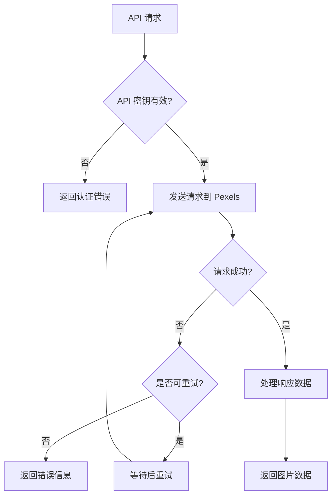

# 随机图片 API 配置设计文档

## 概述

本设计文档描述了如何改进现有的 Pexels API 集成，配置新的 API 密钥，并优化随机图片获取功能。设计重点关注安全性、性能和用户体验。

## 架构

### 当前架构分析
- 现有系统已经集成了 Pexels API
- 使用 `StockPhotoService` 类处理图片获取
- 通过环境变量管理 API 密钥
- 实现了基于会话的图片去重机制

### 改进架构设计
```
┌─────────────────┐    ┌──────────────────┐    ┌─────────────────┐
│   API Routes    │───▶│  Image Service   │───▶│  Pexels API     │
│                 │    │                  │    │                 │
└─────────────────┘    └──────────────────┘    └─────────────────┘
                                │
                                ▼
                       ┌──────────────────┐
                       │  Session Cache   │
                       │  (Memory Store)  │
                       └──────────────────┘
```

## 组件和接口

### 1. 环境配置增强 (Environment Configuration)

**位置**: `backend/src/config/environment.ts`

**改进内容**:
- 将 PEXELS_API_KEY 添加到必需环境变量列表
- 增加 API 密钥验证逻辑
- 添加配置验证函数

**接口定义**:
```typescript
interface PexelsConfig {
  apiKey: string;
  baseUrl: string;
  defaultPerPage: number;
  maxRetries: number;
}
```

### 2. 图片服务优化 (Enhanced Image Service)

**位置**: `backend/src/api/image-description/stock-photo-service.ts`

**改进内容**:
- 增强错误处理和重试机制
- 优化随机选择算法
- 添加 API 使用统计
- 实现更智能的缓存策略

**核心方法**:
```typescript
class StockPhotoService {
  async findRandomImage(query?: string, sessionId?: string): Promise<StockPhotoResultType>
  async validateApiKey(): Promise<boolean>
  async getApiUsageStats(): Promise<ApiUsageStats>
  private async retryWithBackoff<T>(operation: () => Promise<T>): Promise<T>
}
```

### 3. 新增随机图片端点 (Random Image Endpoint)

**位置**: `backend/src/api/image-description/routes.ts`

**新增路由**:
- `GET /api/image-description/random` - 获取完全随机图片
- `GET /api/image-description/random/:category` - 获取分类随机图片
- `GET /api/image-description/validate-api` - 验证 API 配置

### 4. 会话管理优化 (Session Management)

**改进内容**:
- 实现更高效的内存管理
- 添加会话统计和监控
- 支持会话持久化选项

**数据结构**:
```typescript
interface UserSession {
  images: Set<string>;
  lastAccess: number;
  requestCount: number;
  preferences?: ImagePreferences;
}

interface ImagePreferences {
  categories: string[];
  excludeCategories: string[];
  minWidth: number;
  minHeight: number;
}
```

## 数据模型

### API 响应模型
```typescript
interface RandomImageResponse {
  id: string;
  url: string;
  thumbnailUrl: string;
  alt_description: string;
  description: string;
  photographer: string;
  source: 'pexels';
  metadata: {
    width: number;
    height: number;
    category?: string;
    colors: string[];
  };
}
```

### 错误响应模型
```typescript
interface ImageApiError {
  error: string;
  code: 'API_KEY_INVALID' | 'QUOTA_EXCEEDED' | 'NO_IMAGES_FOUND' | 'NETWORK_ERROR';
  details?: string;
  retryAfter?: number;
}
```

## 错误处理

### 1. API 密钥验证
- 启动时验证 API 密钥有效性
- 定期检查 API 配额使用情况
- 提供明确的错误信息和解决建议

### 2. 网络错误处理
- 实现指数退避重试机制
- 设置合理的超时时间
- 提供降级服务（使用缓存图片）

### 3. 配额管理
- 监控 API 使用量
- 实现请求限流
- 在接近配额限制时发出警告

### 错误处理流程


## 测试策略

### 1. 单元测试
- API 密钥验证功能
- 随机选择算法
- 错误处理逻辑
- 会话管理功能

### 2. 集成测试
- Pexels API 集成
- 端到端图片获取流程
- 错误场景测试

### 3. 性能测试
- 并发请求处理
- 内存使用监控
- 响应时间测试

### 测试用例示例
```typescript
describe('StockPhotoService', () => {
  test('should return random image with valid API key', async () => {
    // 测试正常图片获取
  });
  
  test('should handle invalid API key gracefully', async () => {
    // 测试无效 API 密钥处理
  });
  
  test('should avoid duplicate images in same session', async () => {
    // 测试会话内去重功能
  });
});
```

## 安全考虑

### 1. API 密钥安全
- 通过环境变量管理密钥
- 不在日志中记录敏感信息
- 定期轮换 API 密钥

### 2. 请求验证
- 验证用户会话
- 限制请求频率
- 防止 API 滥用

### 3. 数据隐私
- 不存储用户的图片偏好敏感信息
- 定期清理会话数据
- 遵循数据保护法规

## 性能优化

### 1. 缓存策略
- 实现智能图片缓存
- 预加载热门类别图片
- 使用 CDN 加速图片加载

### 2. 内存管理
- 定期清理过期会话
- 限制会话数据大小
- 监控内存使用情况

### 3. 网络优化
- 使用连接池
- 实现请求去重
- 优化图片尺寸选择

## 监控和日志

### 1. 关键指标
- API 调用成功率
- 平均响应时间
- 错误率统计
- 配额使用情况

### 2. 日志记录
- API 调用日志
- 错误详情记录
- 性能指标日志

### 3. 告警机制
- API 配额告警
- 错误率异常告警
- 性能下降告警