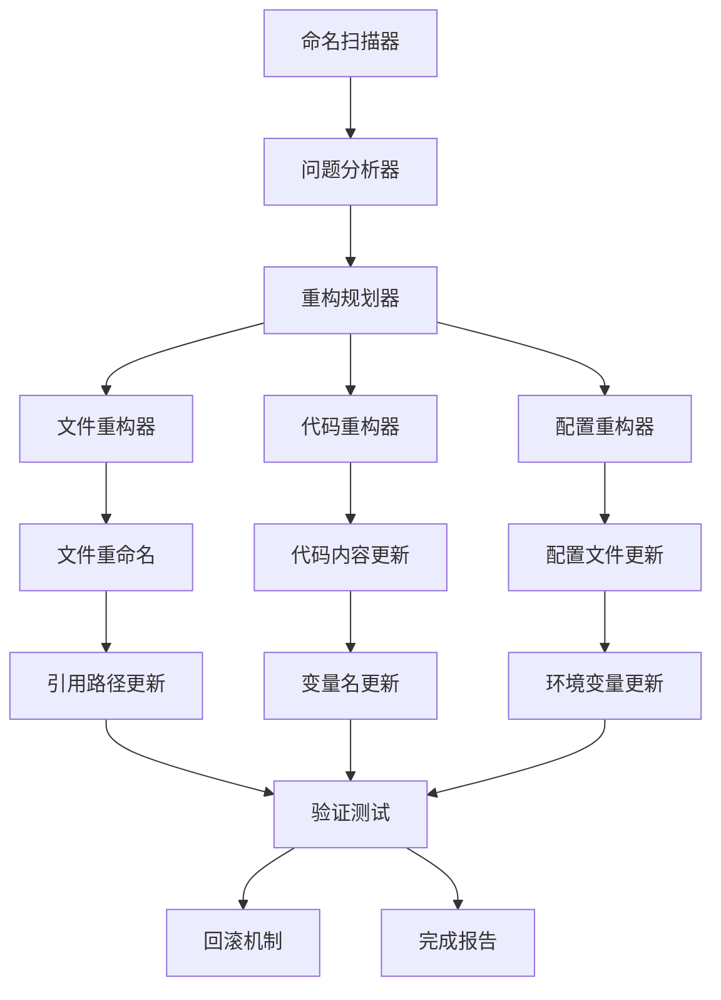

# Design Document

## Overview

基于需求分析和代码扫描结果，本设计文档详细规划了 SeeDream 命名标准化的技术实现方案。通过系统性的重构，将项目中所有不规范的命名（如 SeedRam、SeedDream、seeddream、seedram 等）统一为标准格式。

### 发现的问题范围

通过代码扫描发现以下主要问题：

1. **环境变量不一致**: `SEEDDREAM_*` vs `SEEDRAM_*`
2. **配置键值混乱**: `seeddream` vs `seedram` 
3. **显示名称错误**: `SeedRam 3.0` vs `SeedDream 3.0`
4. **服务类命名错误**: `SeedRamImageService` vs `SeedreamImageService`
5. **文件命名不规范**: `seedram-image-service.js` vs `seedream-image-service.js`

## Architecture

### 命名标准化架构



### 标准化规则矩阵

| 上下文 | 正确格式 | 错误格式 | 示例 |
|--------|----------|----------|------|
| 显示名称 | SeeDream 3.0 | SeedRam 3.0, SeedDream | UI标题、文档标题 |
| 环境变量 | SEEDREAM_* | SEEDDREAM_*, SEEDRAM_* | SEEDREAM_API_KEY |
| 配置键值 | seedream | seeddream, seedram | config.image.seedream |
| 文件命名 | seedream-* | seeddream-*, seedram-* | seedream-image-service.ts |
| 类名 | SeedreamImageService | SeedRamImageService | TypeScript类名 |
| 变量名 | seedream | seedram, seeddream | JavaScript变量 |

## Components and Interfaces

### 1. 命名扫描器 (NamingScanner)

```typescript
interface NamingScanner {
  scanProject(): Promise<ScanResult>;
  scanFiles(patterns: string[]): Promise<FileMatch[]>;
  scanContent(content: string): ContentMatch[];
}

interface ScanResult {
  files: FileMatch[];
  totalMatches: number;
  categories: {
    environmentVariables: Match[];
    configKeys: Match[];
    displayNames: Match[];
    fileNames: Match[];
    classNames: Match[];
    variableNames: Match[];
  };
}
```

### 2. 重构规划器 (RefactorPlanner)

```typescript
interface RefactorPlanner {
  createPlan(scanResult: ScanResult): RefactorPlan;
  validatePlan(plan: RefactorPlan): ValidationResult;
  optimizePlan(plan: RefactorPlan): RefactorPlan;
}

interface RefactorPlan {
  fileRenames: FileRename[];
  contentChanges: ContentChange[];
  referenceUpdates: ReferenceUpdate[];
  dependencies: PlanDependency[];
}
```

### 3. 重构执行器 (RefactorExecutor)

```typescript
interface RefactorExecutor {
  execute(plan: RefactorPlan): Promise<ExecutionResult>;
  rollback(executionId: string): Promise<void>;
  validateExecution(result: ExecutionResult): Promise<ValidationResult>;
}

interface ExecutionResult {
  executionId: string;
  completedActions: RefactorAction[];
  failedActions: RefactorAction[];
  backupPath: string;
  summary: ExecutionSummary;
}
```

## Data Models

### 匹配模式定义

```typescript
interface NamingPattern {
  category: 'environment' | 'config' | 'display' | 'file' | 'class' | 'variable';
  incorrectPatterns: RegExp[];
  correctFormat: string;
  contextRules: ContextRule[];
}

interface ContextRule {
  filePattern: string;
  replacementTemplate: string;
  validationRule: (match: string, context: string) => boolean;
}
```

### 重构动作模型

```typescript
interface RefactorAction {
  id: string;
  type: 'file-rename' | 'content-replace' | 'reference-update';
  source: string;
  target: string;
  dependencies: string[];
  rollbackData: any;
}

interface FileRename extends RefactorAction {
  type: 'file-rename';
  oldPath: string;
  newPath: string;
  updateReferences: boolean;
}

interface ContentReplace extends RefactorAction {
  type: 'content-replace';
  filePath: string;
  replacements: TextReplacement[];
}
```

## Error Handling

### 错误分类和处理策略

1. **扫描错误**
   - 文件访问权限错误 → 跳过并记录
   - 二进制文件误扫 → 自动过滤
   - 大文件超时 → 分块处理

2. **重构错误**
   - 文件重命名冲突 → 生成唯一名称
   - 循环依赖 → 依赖排序算法
   - 语法破坏 → 语法验证 + 回滚

3. **验证错误**
   - 功能测试失败 → 自动回滚
   - 配置验证失败 → 手动修复提示
   - 引用断链 → 引用修复工具

### 回滚机制

```typescript
interface RollbackManager {
  createBackup(files: string[]): Promise<string>;
  rollback(backupId: string): Promise<void>;
  cleanupBackups(olderThan: Date): Promise<void>;
}

interface BackupEntry {
  id: string;
  timestamp: Date;
  files: BackupFile[];
  metadata: BackupMetadata;
}
```

## Testing Strategy

### 测试层级

1. **单元测试**
   - 命名模式匹配测试
   - 重构规则验证测试
   - 文件操作测试

2. **集成测试**
   - 端到端重构流程测试
   - 多文件依赖更新测试
   - 回滚机制测试

3. **验收测试**
   - 应用功能完整性测试
   - 配置有效性测试
   - 性能影响测试

### 测试数据准备

```typescript
interface TestScenario {
  name: string;
  inputFiles: TestFile[];
  expectedOutput: TestFile[];
  validationRules: ValidationRule[];
}

interface TestFile {
  path: string;
  content: string;
  type: 'source' | 'config' | 'documentation';
}
```

## Implementation Phases

### Phase 1: 扫描和分析
- 实现命名扫描器
- 建立问题分类系统
- 生成详细分析报告

### Phase 2: 重构规划
- 设计重构计划算法
- 实现依赖分析
- 建立验证机制

### Phase 3: 安全执行
- 实现备份系统
- 执行重构操作
- 实时验证和回滚

### Phase 4: 验证和清理
- 运行完整测试套件
- 生成变更报告
- 清理临时文件

## Security Considerations

1. **文件安全**
   - 备份重要文件
   - 权限检查
   - 原子操作

2. **配置安全**
   - 敏感信息保护
   - 配置验证
   - 环境隔离

3. **回滚安全**
   - 完整性检查
   - 版本控制集成
   - 审计日志

## Performance Optimization

1. **并行处理**
   - 文件扫描并行化
   - 独立重构操作并行执行
   - 批量文件操作

2. **内存优化**
   - 流式文件处理
   - 增量备份
   - 垃圾回收优化

3. **缓存策略**
   - 扫描结果缓存
   - 依赖关系缓存
   - 验证结果缓存

## Monitoring and Logging

### 日志级别

- **INFO**: 重构进度和成功操作
- **WARN**: 跳过的文件和非关键错误
- **ERROR**: 重构失败和需要人工干预的问题
- **DEBUG**: 详细的操作步骤和中间结果

### 监控指标

- 扫描文件数量和速度
- 重构操作成功率
- 回滚操作频率
- 验证测试通过率

## Configuration Management

### 重构配置文件

```typescript
interface RefactorConfig {
  patterns: NamingPattern[];
  exclusions: string[];
  backupSettings: BackupConfig;
  validationSettings: ValidationConfig;
  rollbackSettings: RollbackConfig;
}

interface BackupConfig {
  enabled: boolean;
  location: string;
  retention: number; // days
  compression: boolean;
}
```

### 环境特定配置

- 开发环境：详细日志 + 交互式确认
- 测试环境：自动化执行 + 完整验证
- 生产环境：保守策略 + 多重备份