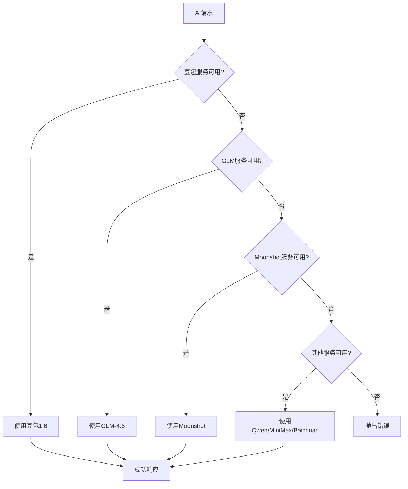
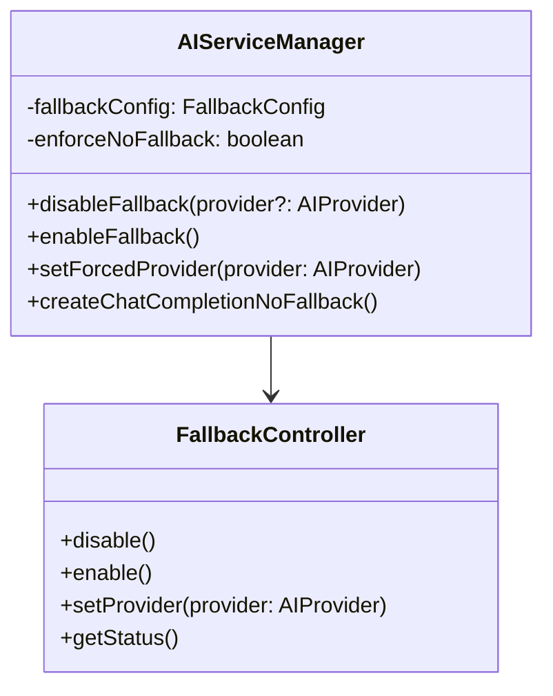
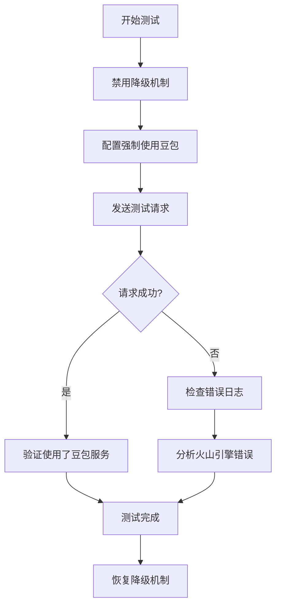

# 禁用AI模型降级机制设计文档

## 1. 概述

为了便于排查火山引擎(豆包1.6)的端点连接问题，需要临时禁用当前系统中的AI模型自动降级机制。当前系统实现了多层降级策略（豆包→GLM→Moonshot→其他），这种自动故障转移机制会掩盖火山引擎服务的具体错误信息，不利于问题诊断。

### 目标
- 禁用AI服务的自动故障转移机制
- 强制使用指定的AI服务提供商
- 保留详细的错误日志用于问题排查
- 提供快速恢复降级机制的能力

## 2. 当前架构分析

### 现有降级机制

当前`AIServiceManager`类实现了如下降级策略：



### 关键组件
- **AIServiceManager**: 核心服务管理器
- **故障检测**: 5分钟冷却机制
- **自动重试**: 最多3次尝试
- **服务优先级**: 固定顺序降级

## 3. 设计方案

### 3.1 配置驱动的降级控制

添加环境变量控制降级行为：

```typescript
interface FallbackConfig {
  enabled: boolean;           // 是否启用降级
  forceProvider?: AIProvider; // 强制使用的提供商
  maxRetries: number;         // 最大重试次数
  logDetailedErrors: boolean; // 记录详细错误
}
```

### 3.2 修改AI服务管理器



### 3.3 实现策略

#### 策略1: 环境变量控制（推荐）
```bash
# 禁用降级，强制使用豆包
AI_FALLBACK_ENABLED=false
AI_FORCED_PROVIDER=doubao

# 启用详细错误日志
AI_LOG_DETAILED_ERRORS=true
```

#### 策略2: 运行时API控制
```typescript
// 禁用降级机制
POST /api/management/ai/disable-fallback
{
  "provider": "doubao",
  "logErrors": true
}

// 恢复降级机制  
POST /api/management/ai/enable-fallback
```

#### 策略3: 代码级控制
```typescript
// 临时禁用方法
aiService.disableFallback('doubao');

// 恢复降级
aiService.enableFallback();
```

## 4. 技术实现

### 4.1 配置更新

扩展环境配置：

```typescript
// environment.ts
export const environment = {
  // ... 现有配置
  ai: {
    fallback: {
      enabled: process.env.AI_FALLBACK_ENABLED !== 'false',
      forcedProvider: process.env.AI_FORCED_PROVIDER as AIProvider,
      maxRetries: Number(process.env.AI_MAX_RETRIES) || 1,
      logDetailedErrors: process.env.AI_LOG_DETAILED_ERRORS === 'true'
    }
  }
};
```

### 4.2 AI服务管理器修改

```typescript
class AIServiceManager {
  private fallbackDisabled: boolean = false;
  private forcedProvider?: AIProvider;

  // 禁用降级机制
  disableFallback(provider?: AIProvider): void {
    this.fallbackDisabled = true;
    this.forcedProvider = provider;
    logger.warn('AI降级机制已禁用', { 
      forcedProvider: provider,
      reason: '调试模式'
    });
  }

  // 启用降级机制
  enableFallback(): void {
    this.fallbackDisabled = false;
    this.forcedProvider = undefined;
    logger.info('AI降级机制已启用');
  }

  // 修改getAvailableClient方法
  private getAvailableClient(): ServiceInfo | null {
    // 如果禁用降级且指定了提供商
    if (this.fallbackDisabled && this.forcedProvider) {
      return this.getSingleProvider(this.forcedProvider);
    }
    
    // 如果禁用降级但未指定提供商，使用默认第一个
    if (this.fallbackDisabled) {
      return this.getSingleProvider('doubao');
    }
    
    // 正常降级逻辑
    return this.getNormalProvider();
  }

  private getSingleProvider(provider: AIProvider): ServiceInfo | null {
    if (provider === 'doubao' && this.doubaoService) {
      return { 
        client: null as any,
        config: AI_CONFIGS[provider],
        isDoubao: true
      };
    }
    
    const client = this.clients.get(provider);
    const config = AI_CONFIGS[provider];
    
    if (client && config) {
      return { client, config };
    }
    
    logger.error(`强制指定的AI服务提供商不可用: ${provider}`);
    return null;
  }
}
```

### 4.3 增强错误日志

```typescript
// 详细错误记录
private logDetailedError(provider: AIProvider, error: any): void {
  const errorDetails = {
    provider,
    timestamp: new Date().toISOString(),
    errorType: error.constructor.name,
    message: error.message,
    stack: error.stack,
    config: AI_CONFIGS[provider],
    // 火山引擎特殊信息
    ...(provider === 'doubao' && {
      volcengineEndpoint: environment.ai.doubao.endpoint,
      volcengineRegion: environment.ai.doubao.region,
      accessKeyId: environment.ai.doubao.accessKeyId ? '已配置' : '未配置'
    })
  };
  
  logger.error('AI服务详细错误信息', errorDetails);
  
  // 写入专门的错误文件用于问题排查
  fs.appendFileSync('logs/ai-service-errors.json', 
    JSON.stringify(errorDetails, null, 2) + ',\n'
  );
}
```

## 5. 管理接口

### 5.1 降级控制API

```typescript
// 禁用降级
router.post('/api/management/ai/disable-fallback', (req, res) => {
  const { provider, logErrors } = req.body;
  
  aiService.disableFallback(provider);
  
  if (logErrors) {
    // 启用详细错误日志
  }
  
  res.json({
    success: true,
    message: '降级机制已禁用',
    config: {
      fallbackDisabled: true,
      forcedProvider: provider
    }
  });
});

// 启用降级
router.post('/api/management/ai/enable-fallback', (req, res) => {
  aiService.enableFallback();
  
  res.json({
    success: true,
    message: '降级机制已启用'
  });
});

// 获取当前状态
router.get('/api/management/ai/fallback-status', (req, res) => {
  res.json({
    fallbackEnabled: !aiService.isFallbackDisabled(),
    forcedProvider: aiService.getForcedProvider(),
    availableProviders: aiService.getAvailableProviders()
  });
});
```

### 5.2 火山引擎专用诊断

```typescript
// 火山引擎连接测试
router.post('/api/management/ai/test-volcengine', async (req, res) => {
  try {
    // 禁用降级，强制测试豆包
    aiService.disableFallback('doubao');
    
    const testMessage = [{
      role: 'user' as const,
      content: '测试连接'
    }];
    
    const result = await aiService.createChatCompletion(testMessage);
    
    res.json({
      success: true,
      message: '火山引擎连接成功',
      response: result
    });
    
  } catch (error) {
    res.status(500).json({
      success: false,
      error: error.message,
      details: {
        endpoint: environment.ai.doubao.endpoint,
        baseUrl: environment.ai.doubao.baseUrl,
        model: environment.ai.doubao.model
      }
    });
  } finally {
    // 恢复降级机制
    aiService.enableFallback();
  }
});
```

## 6. 使用方法

### 6.1 环境变量方式（推荐）

```bash
# 1. 修改.env文件
echo "AI_FALLBACK_ENABLED=false" >> .env
echo "AI_FORCED_PROVIDER=doubao" >> .env
echo "AI_LOG_DETAILED_ERRORS=true" >> .env

# 2. 重启服务
npm run dev

# 3. 测试火山引擎连接
curl -X POST http://localhost:3000/api/vocabulary/generate \
  -H "Content-Type: application/json" \
  -d '{"theme":"test","count":1,"language":"en"}'
```

### 6.2 API方式

```bash
# 1. 禁用降级
curl -X POST http://localhost:3000/api/management/ai/disable-fallback \
  -H "Content-Type: application/json" \
  -d '{"provider":"doubao","logErrors":true}'

# 2. 测试连接
curl -X POST http://localhost:3000/api/management/ai/test-volcengine

# 3. 查看状态
curl http://localhost:3000/api/management/ai/fallback-status

# 4. 恢复降级
curl -X POST http://localhost:3000/api/management/ai/enable-fallback
```

### 6.3 错误日志查看

```bash
# 查看详细错误日志
tail -f logs/ai-service-errors.json

# 查看一般日志
tail -f logs/backend.log | grep "doubao\|volcengine"
```

## 7. 测试策略

### 7.1 功能测试



### 7.2 测试用例

| 测试场景 | 预期结果 | 验证方法 |
|---------|---------|---------|
| 禁用降级+豆包可用 | 成功响应 | 检查日志确认使用豆包 |
| 禁用降级+豆包不可用 | 立即失败 | 不尝试其他服务 |
| 详细错误日志 | 记录完整错误信息 | 检查错误日志文件 |
| API控制 | 动态开关降级 | 状态接口验证 |

## 8. 注意事项

### 8.1 安全考虑
- 仅在开发/测试环境使用
- 生产环境应保持降级机制
- 避免长时间禁用降级

### 8.2 性能影响
- 禁用降级会降低系统容错能力
- 增加详细日志可能影响性能
- 建议定期清理错误日志文件

### 8.3 恢复机制
- 提供多种恢复降级的方法
- 服务重启自动恢复默认配置
- 管理界面提供一键恢复