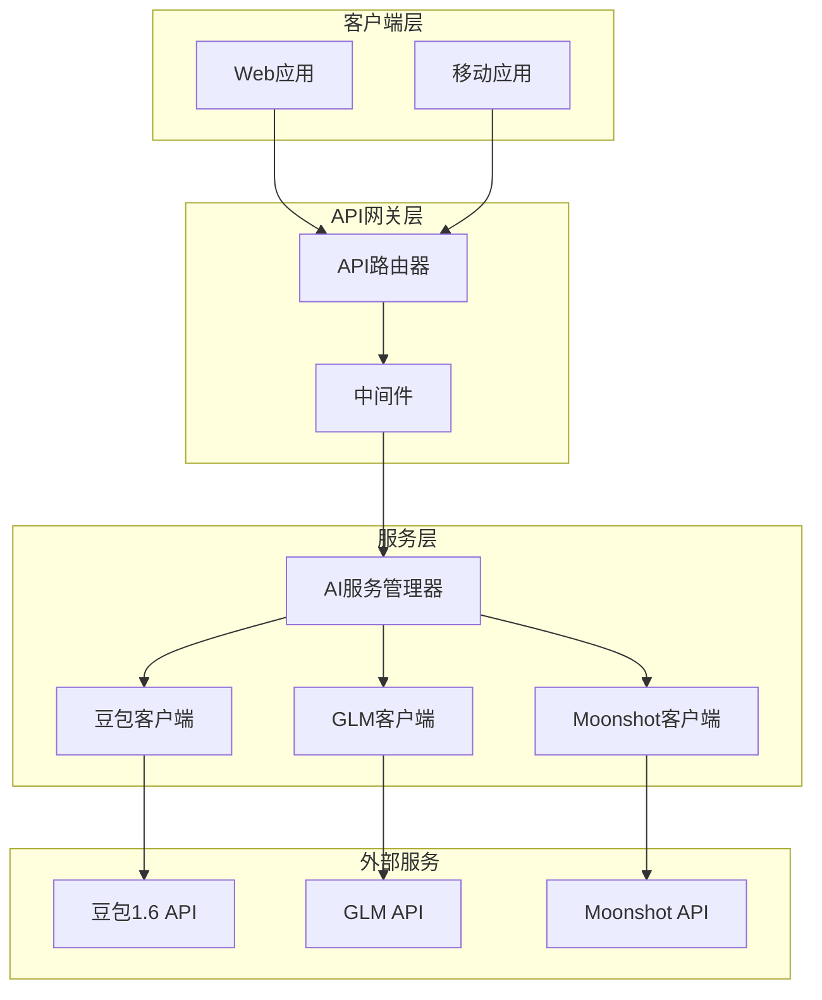
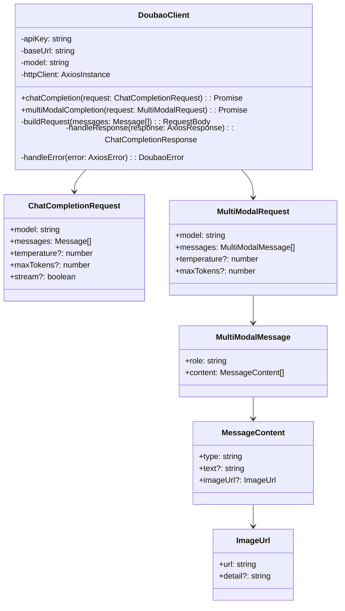
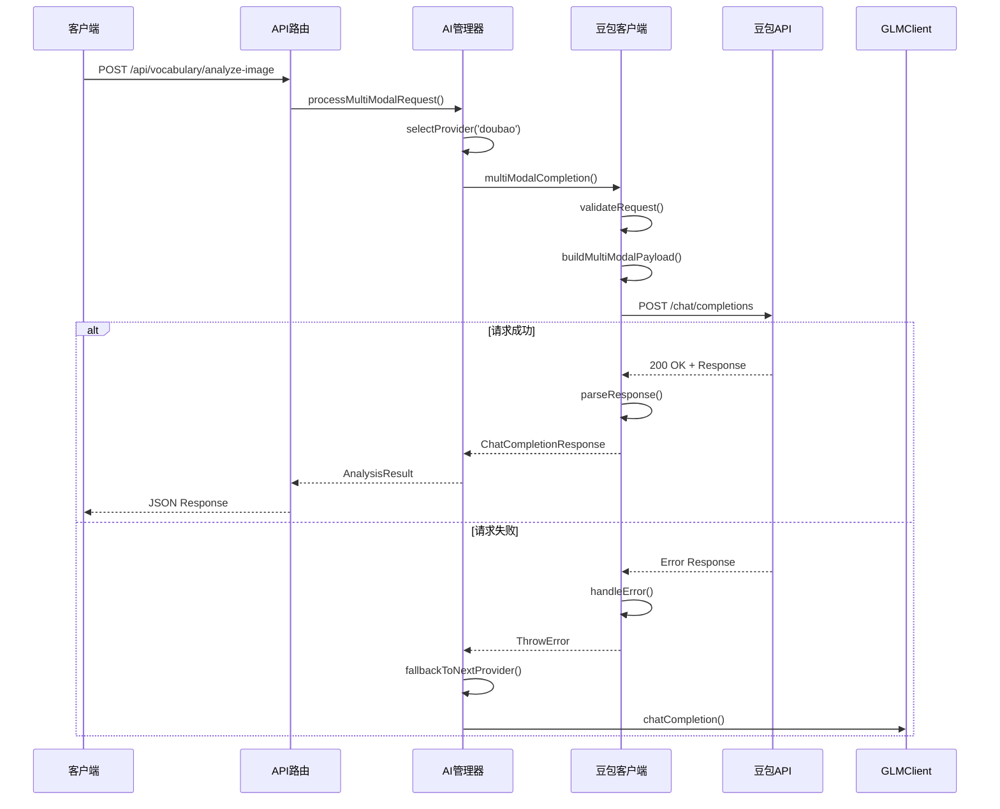
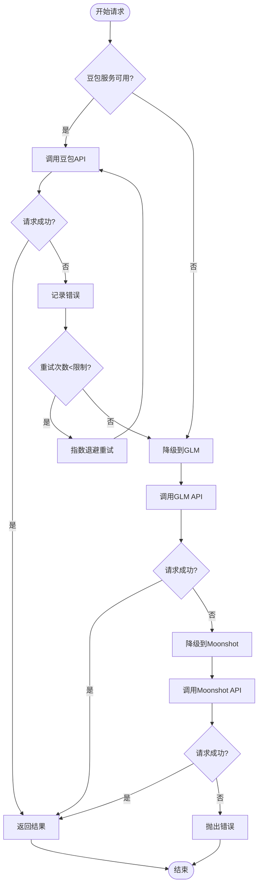
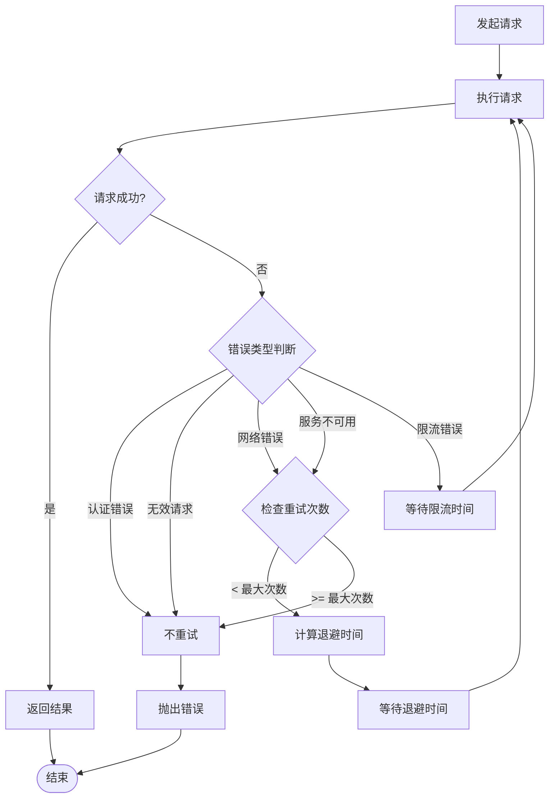

# 豆包1.6 API客户端设计文档

## 概述

豆包1.6是火山引擎提供的多模态大语言模型，支持文本和图像输入，具备强大的图像理解和文本生成能力。本设计文档描述了在现有WordPecker项目中集成豆包1.6 API客户端的实现方案。

### 核心特性
- 多模态输入支持（文本+图像）
- 与现有AI服务架构无缝集成
- 故障转移和冗余机制
- 统一的API抽象层
- 性能监控和错误处理

## 技术栈

| 组件 | 技术选型 | 说明 |
|-----|---------|------|
| API客户端 | HTTP/REST | 基于火山引擎REST API |
| 认证方式 | Bearer Token | API密钥认证 |
| 数据格式 | JSON | 请求/响应格式 |
| 错误处理 | 指数退避重试 | 网络容错机制 |
| 配置管理 | 环境变量 | 统一配置管理 |
| 图像生成 | SeeDream 3.0 | 火山引擎图像生成服务 |

## 架构设计

### 系统架构图



### 豆包客户端核心架构



## API端点集成

### 请求格式规范

#### 多模态聊天完成端点
```
POST https://ark.cn-beijing.volces.com/api/v3/chat/completions
```

#### SeeDream 3.0图像生成端点
```
POST https://ark.cn-beijing.volces.com/api/v3/images/generations
```

#### 请求头配置
```json
{
  "Content-Type": "application/json",
  "Authorization": "Bearer {API_KEY}"
}
```

#### 多模态请求体结构
```typescript
interface DoubaoMultiModalRequest {
  model: string;  // "doubao-seed-1-6-250615"
  messages: MultiModalMessage[];
  temperature?: number;
  max_tokens?: number;
  stream?: boolean;
}

interface MultiModalMessage {
  role: "user" | "assistant" | "system";
  content: MessageContent[];
}

interface MessageContent {
  type: "text" | "image_url";
  text?: string;
  image_url?: {
    url: string;
    detail?: "low" | "high" | "auto";
  };
}
```

#### SeeDream 3.0图像生成请求体结构
```typescript
interface SeedreamImageRequest {
  model: string;  // "doubao-seedream-3-0-t2i-250415"
  prompt: string;
  response_format?: "url" | "b64_json";
  size?: "1024x1024" | "1280x720" | "720x1280" | "512x512";
  guidance_scale?: number;  // 1-10, 推荐 3-7
  watermark?: boolean;
  n?: number;  // 生成图片数量，默认 1
  style?: string;  // 图像风格，可选
}
```
```typescript
interface DoubaoMultiModalRequest {
  model: string;  // "doubao-seed-1-6-250615"
  messages: MultiModalMessage[];
  temperature?: number;
  max_tokens?: number;
  stream?: boolean;
}

interface MultiModalMessage {
  role: "user" | "assistant" | "system";
  content: MessageContent[];
}

interface MessageContent {
  type: "text" | "image_url";
  text?: string;
  image_url?: {
    url: string;
    detail?: "low" | "high" | "auto";
  };
}
```

### 响应处理

#### 成功响应格式
```typescript
interface DoubaoResponse {
  id: string;
  object: "chat.completion";
  created: number;
  model: string;
  choices: Choice[];
  usage: Usage;
}

interface Choice {
  index: number;
  message: ResponseMessage;
  finish_reason: string;
}

interface ResponseMessage {
  role: "assistant";
  content: string;
}

interface Usage {
  prompt_tokens: number;
  completion_tokens: number;
  total_tokens: number;
}
```

#### SeeDream 3.0图像生成响应格式
```typescript
interface SeedreamImageResponse {
  id: string;
  object: "image.generation";
  created: number;
  model: string;
  data: ImageData[];
  usage?: ImageUsage;
}

interface ImageData {
  url?: string;
  b64_json?: string;
  revised_prompt?: string;
}

interface ImageUsage {
  prompt_tokens: number;
  total_tokens: number;
}
```

## 数据流设计

### 多模态请求处理流程



### 故障转移机制



## 核心组件实现

### 豆包服务客户端

```typescript
// doubao-service.ts 核心接口
interface DoubaoService {
  // 基础文本聊天
  chatCompletion(request: ChatCompletionRequest): Promise<ChatCompletionResponse>;
  
  // 多模态输入处理
  multiModalCompletion(request: MultiModalRequest): Promise<ChatCompletionResponse>;
  
  // 图像分析专用方法
  analyzeImage(imageUrl: string, prompt: string): Promise<ImageAnalysisResult>;
  
  // 健康检查
  healthCheck(): Promise<ServiceHealth>;
}

// seedream-image-service.ts 核心接口
interface SeedreamImageService {
  // 图像生成
  generateImage(request: SeedreamImageRequest): Promise<SeedreamImageResponse>;
  
  // 批量图像生成
  generateImages(requests: SeedreamImageRequest[]): Promise<SeedreamImageResponse[]>;
  
  // 健康检查
  healthCheck(): Promise<ServiceHealth>;
  
  // 获取支持的模型列表
  getSupportedModels(): Promise<string[]>;
}
```

### 配置管理扩展

```typescript
// environment.ts 豆包配置部分
export const environment = {
  ai: {
    doubao: {
      apiKey: process.env.DOUBAO_API_KEY || '',
      baseUrl: process.env.DOUBAO_BASE_URL || 'https://ark.cn-beijing.volces.com/api/v3',
      model: process.env.DOUBAO_MODEL || 'doubao-seed-1-6-250615',
      endpoint: process.env.DOUBAO_ENDPOINT || '',
      maxRetries: Number(process.env.DOUBAO_MAX_RETRIES) || 3,
      timeout: Number(process.env.DOUBAO_TIMEOUT) || 30000,
      region: process.env.DOUBAO_REGION || 'cn-beijing'
    }
  },
  image: {
    seedream: {
      apiKey: process.env.SEEDREAM_API_KEY || '',
      baseUrl: process.env.SEEDREAM_BASE_URL || 'https://ark.cn-beijing.volces.com/api/v3',
      model: process.env.SEEDREAM_MODEL || 'doubao-seedream-3-0-t2i-250415',
      defaultSize: process.env.SEEDREAM_DEFAULT_SIZE || '1024x1024',
      guidanceScale: Number(process.env.SEEDREAM_GUIDANCE_SCALE) || 3,
      watermark: process.env.SEEDREAM_WATERMARK !== 'false',
      maxRetries: Number(process.env.SEEDREAM_MAX_RETRIES) || 3,
      timeout: Number(process.env.SEEDREAM_TIMEOUT) || 60000
    }
  }
}
```

### AI服务管理器集成

```typescript
// ai-service.ts 扩展
class AIServiceManager {
  private doubaoClient: DoubaoClient;
  private seedreamImageService: SeedreamImageService;
  
  constructor() {
    this.doubaoClient = new DoubaoClient(environment.ai.doubao);
    this.seedreamImageService = new SeedreamImageService(environment.image.seedream);
    this.currentProvider = 'doubao'; // 豆包优先
  }
  
  async createChatCompletion(request: ChatCompletionRequest): Promise<ChatCompletionResponse> {
    const provider = this.getAvailableProvider();
    
    if (provider === 'doubao') {
      return this.doubaoClient.chatCompletion(request);
    }
    
    // 降级到其他服务...
  }
  
  async generateImage(request: ImageGenerationRequest): Promise<ImageGenerationResponse> {
    try {
      // 优先使用 SeeDream 3.0
      const seedreamRequest: SeedreamImageRequest = {
        model: environment.image.seedream.model,
        prompt: request.prompt,
        size: request.size || environment.image.seedream.defaultSize,
        guidance_scale: request.guidanceScale || environment.image.seedream.guidanceScale,
        watermark: environment.image.seedream.watermark
      };
      
      return await this.seedreamImageService.generateImage(seedreamRequest);
    } catch (error) {
      // 降级到其他图像服务（Pexels、DALL-E等）
      logger.warn('SeeDream 图像生成失败，降级到备用服务', { error });
      return this.fallbackImageGeneration(request);
    }
  }
}
```

## API路由设计

### 多模态分析端点

| 端点 | 方法 | 描述 | 请求体 |
|-----|------|------|-------|
| `/api/vocabulary/analyze-image` | POST | 分析图像并生成词汇 | MultiModalAnalysisRequest |
| `/api/quiz/image-question` | POST | 基于图像生成测试题 | ImageQuestionRequest |
| `/api/image-description/multimodal` | POST | 多模态图像描述 | MultiModalDescriptionRequest |
| `/api/images/generate` | POST | SeeDream 3.0图像生成 | SeedreamImageRequest |
| `/api/images/batch-generate` | POST | 批量图像生成 | BatchImageRequest |

### 请求响应示例

#### 图像词汇分析请求
```json
{
  "imageUrl": "https://example.com/image.jpg",
  "targetLanguage": "english",
  "difficulty": "intermediate",
  "prompt": "分析这张图片并生成相关的英语词汇"
}
```

#### SeeDream 3.0图像生成请求
```json
{
  "prompt": "鱼眼镜头，一只猫咪的头部，画面呈现出猫咪的五官因为拍摄方式扭曲的效果。",
  "size": "1024x1024",
  "guidance_scale": 3,
  "watermark": true,
  "response_format": "url"
}
```

#### SeeDream 3.0图像生成响应
```json
{
  "success": true,
  "data": {
    "id": "img_abc123",
    "object": "image.generation",
    "created": 1703123456,
    "model": "doubao-seedream-3-0-t2i-250415",
    "data": [
      {
        "url": "https://example.com/generated-image.jpg",
        "revised_prompt": "鱼眼镜头效果的猫咪头部特写，展现扭曲的视觉效果"
      }
    ],
    "usage": {
      "prompt_tokens": 25,
      "total_tokens": 25
    }
  }
}
```

#### 图像词汇分析响应
```json
{
  "success": true,
  "analysis": {
    "description": "这是一张城市街景图片...",
    "vocabulary": [
      {
        "word": "skyscraper",
        "definition": "A very tall building",
        "context": "The skyscraper dominates the city skyline"
      }
    ]
  },
  "usage": {
    "promptTokens": 120,
    "completionTokens": 80,
    "totalTokens": 200
  }
}
```
```json
{
  "success": true,
  "analysis": {
    "description": "这是一张城市街景图片...",
    "vocabulary": [
      {
        "word": "skyscraper",
        "definition": "A very tall building",
        "context": "The skyscraper dominates the city skyline"
      }
    ]
  },
  "usage": {
    "promptTokens": 120,
    "completionTokens": 80,
    "totalTokens": 200
  }
}
```

## 错误处理策略

### 错误类型定义

```typescript
enum DoubaoErrorType {
  AUTHENTICATION_ERROR = 'AUTHENTICATION_ERROR',
  RATE_LIMIT_ERROR = 'RATE_LIMIT_ERROR',
  QUOTA_EXCEEDED = 'QUOTA_EXCEEDED',
  NETWORK_ERROR = 'NETWORK_ERROR',
  INVALID_REQUEST = 'INVALID_REQUEST',
  SERVICE_UNAVAILABLE = 'SERVICE_UNAVAILABLE'
}

interface DoubaoError extends Error {
  type: DoubaoErrorType;
  code?: string;
  statusCode?: number;
  retryAfter?: number;
  details?: any;
}
```

### 重试策略



## 性能监控

### 指标收集

```typescript
interface DoubaoMetrics {
  // 请求统计
  totalRequests: number;
  successfulRequests: number;
  failedRequests: number;
  
  // 性能指标
  averageResponseTime: number;
  p95ResponseTime: number;
  p99ResponseTime: number;
  
  // 错误统计
  errorsByType: Map<DoubaoErrorType, number>;
  
  // 使用统计
  tokenUsage: {
    promptTokens: number;
    completionTokens: number;
    totalTokens: number;
  };
  
  // 多模态特定指标
  multiModalRequests: number;
  imageProcessingTime: number;
}
```

### 健康检查端点

```typescript
// GET /api/health/doubao
interface DoubaoHealthResponse {
  status: 'healthy' | 'degraded' | 'unhealthy';
  latency: number;
  uptime: number;
  lastError?: string;
  errorRate: number;
  metrics: DoubaoMetrics;
}
```

## 安全考虑

### API密钥管理
- 环境变量存储
- 密钥轮换支持
- 访问权限控制
- 审计日志记录

### 数据保护
- 图像URL验证
- 敏感信息过滤
- 传输加密(HTTPS)
- 请求内容审核

### 访问控制
```typescript
interface SecurityConfig {
  maxRequestsPerMinute: number;
  allowedImageDomains: string[];
  contentFilter: boolean;
  ipWhitelist?: string[];
}
```

## 集成测试

### 单元测试覆盖

| 测试类别 | 覆盖范围 | 文件 |
|---------|---------|------|
| 客户端核心功能 | API调用、错误处理 | `doubao-client.test.ts` |
| 多模态请求 | 图像+文本处理 | `multimodal.test.ts` |
| 故障转移 | 降级机制测试 | `failover.test.ts` |
| 配置管理 | 环境变量验证 | `config.test.ts` |

### 集成测试场景

```typescript
describe('豆包API集成测试', () => {
  test('文本聊天完成', async () => {
    const response = await doubaoClient.chatCompletion({
      model: 'doubao-seed-1-6-250615',
      messages: [{ role: 'user', content: '你好' }]
    });
    expect(response.choices[0].message.content).toBeDefined();
  });
  
  test('多模态图像分析', async () => {
    const response = await doubaoClient.multiModalCompletion({
      model: 'doubao-seed-1-6-250615',
      messages: [{
        role: 'user',
        content: [
          { type: 'image_url', image_url: { url: 'test-image-url' } },
          { type: 'text', text: '图片主要讲了什么?' }
        ]
      }]
    });
    expect(response.choices[0].message.content).toContain('图');
  });
});
```