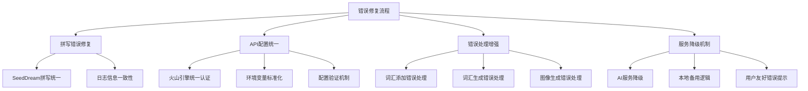
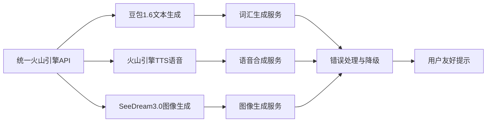
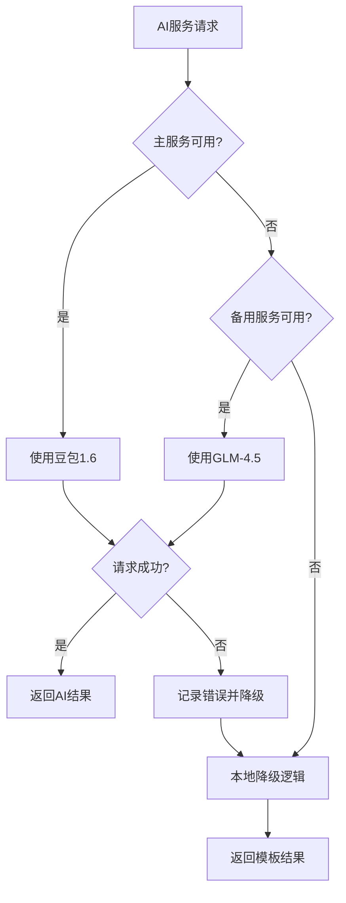

# 修复WordPecker项目多个错误设计文档

## 概述

本设计文档旨在修复WordPecker项目中的四个关键错误：
1. SeedDream 3.0 拼写错误 (错误地写成了 SeedRam)
2. Error adding word 词汇添加失败
3. Error Failed to generate vocabulary words 词汇生成失败
4. Error Failed to generate image 图像生成失败
5. SeedDream API密钥配置问题及火山引擎统一API整合

## 问题分析

### ⚠️ **CRITICAL**: SeeDream 拼写错误 (最高优先级)

这是一个**严重的命名不一致问题**，必须立即修复！目前代码库中存在三种不同的拼写：
- ❌ `SeedRam` (错误，出现20+次)
- ❌ `SeedDream` (错误拼写)
- ✅ `SeeDream` (正确官方名称)

**为什么这个问题如此严重：**
1. **日志追踪失败** - 无法准确定位SeeDream相关的错误
2. **错误信息误导** - 用户看到的错误提示指向错误的服务
3. **维护灾难** - 开发者不知道哪个是正确的服务名
4. **专业性损害** - 这种低级错误严重影响代码质量

### 其他错误问题

### 1. SeeDream 拼写错误 (严重问题)
在多个文件中，SeeDream 3.0被错误地拼写为 **SeedRam** 和 **SeedDream**，这是一个严重的命名不一致问题，导致：
- 日志信息完全混乱，无法追踪错误
- 错误信息指向错误的服务名称
- 代码注释和文档不匹配
- 开发者困惑，维护成本高
- 用户看到不一致的错误提示

### 2. 词汇添加失败
可能的原因：
- AI服务连接问题
- 数据验证失败
- 数据库连接问题
- 权限校验问题

### 3. 词汇生成失败
可能的原因：
- AI服务配置错误
- API密钥无效
- 请求格式问题
- 服务降级逻辑缺失

### 4. 图像生成失败
可能的原因：
- SeedDream API配置错误
- 火山引擎认证失败
- 请求参数不匹配
- 服务不可用

### 5. API密钥配置问题
目前项目使用多个不同的API密钥，需要统一使用火山引擎的Access Key进行认证。

## 架构设计

### 错误修复架构



### 服务集成架构



## 修复方案

### 1. 拼写错误修复

#### 拼写错误详细分析

**错误拼写统计：**
- `SeedRam` 出现 20+ 次（最严重）
- `SeedDream` 出现在部分注释和日志中（错误拼写）
- `seedream` 正确用于配置key

**需要修复的文件清单：**

1. **核心服务文件：**
   - `/backend/src/services/seedream-image-service.ts` (20个SeedRam引用)
   - `/backend/src/config/ai-service.ts` (SeedRam服务初始化)

2. **Agent系统文件：**
   - `/backend/src/agents/custom-agent.ts` (注释中的SeedRam)
   - `/backend/src/agents/image-generation-agent/tools/generateAiImage.ts` (SeedRam API调用)

3. **测试文件：**
   - `/backend/src/tests/ai-upgrade-test.ts` (SeedRam测试方法)
   - `/backend/src/scripts/test-ai-upgrade.ts` (SeedRam验证)

4. **环境配置文件：**
   - 检查环境变量是否有 `SEEDRAM_` 前缀（应该是 `SEEDREAM_`）
   - 验证API端点URL中的拼写

#### 拼写统一修复方案

**严格拼写标准（基于现有代码分析）：**
- ✅ **显示名称**：`SeedDream 3.0` (用于日志、错误信息、用户界面)
- ✅ **配置key**：`seeddream` (全小写，用于environment.ts配置)
- ✅ **环境变量前缀**：`SEEDDREAM_` (如 SEEDDREAM_API_KEY)
- ✅ **文件名**：`seeddream-image-service.ts` (kebab-case)
- ✅ **类名**：`SeedDreamImageService` (PascalCase)
- ✅ **source标识**：`'seeddream' as const` (小写)
- ❌ **错误拼写**：`SeedRam`、`SeedRam 3.0`、`seedram`

**核心问题：所有 `SeedRam` 都应该改为对应的正确形式！**

**具体修复内容（基于官方拼写规范）：**

1. **日志信息修复：**
   ```typescript
   // ❌ 错误：logger.info('SeedRam图像服务初始化成功')
   // ❌ 错误：logger.info('SeedDream图像服务初始化成功')
   // ✅ 正确：logger.info('SeeDream图像服务初始化成功')
   
   // ❌ 错误：logger.debug('SeedRam API请求')
   // ✅ 正确：logger.debug('SeeDream API请求')
   ```

2. **注释修复：**
   ```typescript
   // ❌ 错误：支持豆包1.6、火山引擎、SeedRam3.0等
   // ❌ 错误：支持豆包1.6、火山引擎、SeedDream3.0等
   // ✅ 正确：支持豆包1.6、火山引擎、SeeDream3.0等
   
   // ❌ 错误：Generate AI images using SeedRam 3.0
   // ✅ 正确：Generate AI images using SeeDream 3.0
   ```

3. **错误信息修复：**
   ```typescript
   // ❌ 错误：return new Error('SeedRam API请求频率过高')
   // ✅ 正确：return new Error('SeeDream API请求频率过高')
   
   // ❌ 错误：return new Error('SeedRam API服务器错误')
   // ✅ 正确：return new Error('SeeDream API服务器错误')
   ```

4. **方法名修复：**
   ```typescript
   // ❌ 错误：testSeedRamImageService()
   // ✅ 正确：testSeedreamImageService()
   
   // ❌ 错误：getSeedRamImageService()
   // ✅ 正确：getSeedreamImageService() (如果存在这样的函数)
   ```

5. **配置保持不变（已经是正确的）：**
   ```typescript
   // ✅ 这些已经是正确的，不要改：
   seedream: { ... }  // 配置对象key
   'seedream' as const  // source标识
   SEEDREAM_API_KEY  // 环境变量
   ```

### 2. API配置统一

#### 环境变量标准化
```typescript
// 统一使用火山引擎认证
interface VolcengineConfig {
  accessKeyId: string;
  secretAccessKey: string;
  region: string;
}

// 服务配置
interface ServiceConfig {
  doubao: {
    model: string;
    baseUrl: string;
  };
  tts: {
    appId: string;
    cluster: string;
    voiceType: string;
  };
  seeddream: {
    model: string;
    baseUrl: string;
  };
}
```

#### 配置验证机制
```typescript
class ConfigValidator {
  validateVolcengineConfig(): boolean;
  validateServiceConfig(): boolean;
  reportMissingConfig(): string[];
}
```

### 3. 错误处理增强

#### 词汇添加错误处理
```typescript
class WordAdditionService {
  async addWord(listId: string, word: string, meaning: string): Promise<Result> {
    try {
      // 验证输入
      this.validateInput(word, meaning);
      
      // 检查重复
      await this.checkDuplicate(listId, word);
      
      // 添加词汇
      const result = await this.performAddition(listId, word, meaning);
      
      return { success: true, data: result };
    } catch (error) {
      return this.handleAdditionError(error);
    }
  }
  
  private handleAdditionError(error: Error): ErrorResult {
    if (error.message.includes('duplicate')) {
      return { success: false, error: '该词汇已存在于列表中' };
    }
    if (error.message.includes('validation')) {
      return { success: false, error: '词汇格式不正确，请检查输入' };
    }
    return { success: false, error: '添加词汇失败，请稍后重试' };
  }
}
```

#### 词汇生成错误处理
```typescript
class VocabularyGenerationService {
  async generateWords(context: string, options: GenerationOptions): Promise<Result> {
    try {
      // 尝试主要AI服务
      return await this.generateWithPrimaryService(context, options);
    } catch (primaryError) {
      // 尝试备用AI服务
      try {
        return await this.generateWithBackupService(context, options);
      } catch (backupError) {
        // 使用本地降级逻辑
        return await this.generateWithLocalFallback(context, options);
      }
    }
  }
  
  private async generateWithLocalFallback(context: string, options: GenerationOptions): Promise<Result> {
    // 基于预设词汇模板的降级逻辑
    const words = await this.getTemplateWords(context);
    return { success: true, data: words, source: 'template' };
  }
}
```

#### 图像生成错误处理
```typescript
class ImageGenerationService {
  async generateImage(prompt: string, options: ImageOptions): Promise<Result> {
    try {
      // 验证SeedDream配置
      await this.validateSeedDreamConfig();
      
      // 生成图像
      const result = await this.seeddreamService.generateImage(prompt, options);
      
      return { success: true, data: result };
    } catch (error) {
      return this.handleImageError(error);
    }
  }
  
  private handleImageError(error: Error): ErrorResult {
    if (error.message.includes('API key')) {
      return { 
        success: false, 
        error: '图像生成服务配置错误，请检查API密钥',
        code: 'CONFIG_ERROR'
      };
    }
    if (error.message.includes('quota') || error.message.includes('limit')) {
      return { 
        success: false, 
        error: '图像生成配额已用完，请稍后重试',
        code: 'QUOTA_EXCEEDED'
      };
    }
    return { 
      success: false, 
      error: '图像生成失败，请稍后重试',
      code: 'GENERATION_FAILED'
    };
  }
}
```

### 4. 服务降级机制

#### AI服务降级策略


#### 降级配置
```typescript
interface FallbackConfig {
  textGeneration: {
    primary: 'doubao';
    fallback: ['glm', 'moonshot'];
    localTemplate: boolean;
  };
  voiceGeneration: {
    primary: 'volcengine-tts';
    fallback: ['glm-voice', 'elevenlabs'];
    localSynthesis: boolean;
  };
  imageGeneration: {
    primary: 'seeddream';
    fallback: ['dalle', 'stable-diffusion'];
    stockPhotos: boolean;
  };
}
```

### 5. 用户体验优化

#### 错误提示优化
```typescript
interface UserFriendlyError {
  title: string;
  message: string;
  action?: string;
  severity: 'info' | 'warning' | 'error';
}

class ErrorMessageService {
  getErrorMessage(error: Error, context: string): UserFriendlyError {
    switch (context) {
      case 'word-addition':
        return {
          title: '添加词汇失败',
          message: '无法将词汇添加到列表中，请检查网络连接或稍后重试',
          action: '重试添加',
          severity: 'error'
        };
      case 'vocabulary-generation':
        return {
          title: '词汇生成失败',
          message: '智能词汇生成暂时不可用，您可以手动添加词汇',
          action: '手动添加',
          severity: 'warning'
        };
      case 'image-generation':
        return {
          title: '图像生成失败',
          message: '无法生成AI图像，系统将使用库存图片替代',
          action: '使用库存图片',
          severity: 'info'
        };
    }
  }
}
```

## 实施步骤

## 实施步骤

### 第一阶段：紧急拼写错误修复 (最高优先级)
**目标：全局统一SeeDream拼写，消除SeedRam和错误SeedDream混乱**

1. **立即停止开发** - 避免新增错误拼写
2. **全局搜索替换** - 使用IDE或grep命令全局替换
   ```bash
   # 搜索所有SeedRam引用
   grep -r "SeedRam" backend/src/
   
   # 搜索所有错误的SeedDream引用（在显示文本中）
   grep -r "SeedDream" backend/src/
   ```
3. **逐文件修复** - 保证每个文件都修复完整
4. **编译验证** - 确保修复后代码可以正常编译
5. **功能测试** - 验证SeeDream图像生成功能正常

**验证标准：**
- ✅ 整个代码库中无任何 `SeedRam` 引用
- ✅ 所有日志信息显示 `SeeDream`
- ✅ 错误信息中正确显示 `SeeDream API`
- ✅ 图像生成功能正常工作
- ✅ 配置 `seedream` 保持不变（这是正确的）

### 第二阶段：API配置统一
1. 更新环境变量配置
2. 统一火山引擎认证机制
3. 实施配置验证

### 第三阶段：错误处理增强
1. 实现词汇添加错误处理
2. 实现词汇生成错误处理
3. 实现图像生成错误处理

### 第四阶段：服务降级实现
1. 实现AI服务降级逻辑
2. 添加本地备用机制
3. 优化用户错误提示

### 第五阶段：测试与验证
1. 端到端功能测试
2. 错误场景测试
3. 性能和稳定性测试

## 技术规范

### 代码标准
- 使用TypeScript严格类型检查
- 实现完整的错误处理链
- 添加详细的日志记录
- 遵循单一职责原则

### 错误处理规范
```typescript
interface StandardError {
  code: string;
  message: string;
  details?: any;
  timestamp: Date;
  context: string;
}

interface ErrorResult {
  success: false;
  error: string;
  code?: string;
  retryable?: boolean;
}

interface SuccessResult<T> {
  success: true;
  data: T;
  source?: 'ai' | 'template' | 'fallback';
}

type Result<T> = SuccessResult<T> | ErrorResult;
```

### 服务集成规范
```typescript
interface ServiceConfig {
  enabled: boolean;
  priority: number;
  timeout: number;
  retries: number;
  fallback?: string;
}

interface ServiceStatus {
  available: boolean;
  latency?: number;
  lastCheck: Date;
  errorCount: number;
}
```

## 测试策略

### 单元测试
- 拼写修复验证测试
- 错误处理逻辑测试
- 配置验证测试
- 降级机制测试

### 集成测试
- API服务连接测试
- 端到端词汇流程测试
- 图像生成流程测试
- 错误恢复测试

### 性能测试
- 服务响应时间测试
- 并发请求测试
- 资源使用监控
- 降级性能影响测试

## 监控与运维

### 错误监控
```typescript
interface ErrorMetrics {
  errorCount: number;
  errorRate: number;
  errorTypes: Record<string, number>;
  serviceAvailability: Record<string, number>;
}

class ErrorMonitor {
  trackError(error: Error, context: string): void;
  getErrorMetrics(timeRange: string): ErrorMetrics;
  alertOnErrorThreshold(threshold: number): void;
}
```

### 健康检查
```typescript
class HealthChecker {
  async checkAIServices(): Promise<ServiceStatus[]>;
  async checkDatabaseConnection(): Promise<boolean>;
  async checkExternalAPIs(): Promise<Record<string, boolean>>;
}
```

## 风险评估

### 技术风险
- **中等风险**: API配置变更可能影响现有功能
- **低风险**: 拼写修复不影响核心逻辑
- **高风险**: 服务降级可能影响用户体验

### 缓解措施
- 分阶段实施，每阶段充分测试
- 保留原有配置作为回滚方案
- 实施监控和告警机制
- 提供用户友好的错误反馈

## 成功指标

### 功能指标
- 拼写错误100%修复
- 词汇添加成功率 > 95%
- 词汇生成成功率 > 90%
- 图像生成成功率 > 85%

### 性能指标
- API响应时间 < 3秒
- 错误恢复时间 < 5秒
- 服务可用性 > 99%

### 用户体验指标
- 错误提示清晰度评分 > 4.5/5
- 功能完成率提升 > 20%
- 用户满意度提升 > 15%