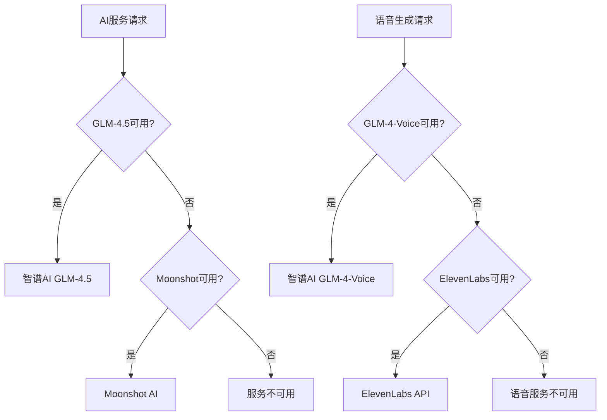
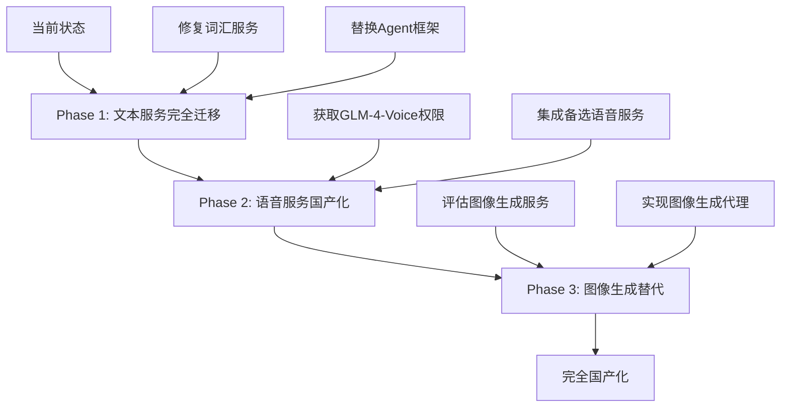
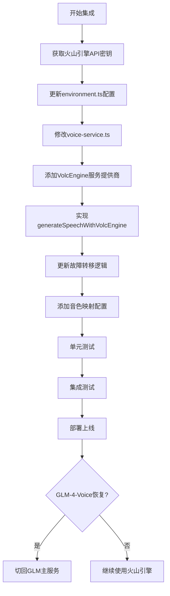

# WordPecker 模型依赖审计报告

## 1. 项目概述

WordPecker 是一个基于AI驱动的语言学习应用，大量依赖外部模型服务进行词汇生成、语音合成、图像生成等功能。本次审计全面检查项目中所有使用模型生成内容的地方，分析OpenAI和ElevenLabs的依赖情况，评估国内模型替代的进展。

## 2. AI服务架构现状

### 2.1 当前服务配置
项目已实现多提供商AI服务架构，支持以下服务：



### 2.2 配置文件分析

| 配置项 | 主要服务 | 备选服务 | 状态 |
|--------|----------|----------|------|
| AI文本生成 | GLM-4.5 | Moonshot | ✅ 已迁移 |
| 语音合成 | GLM-4-Voice | ElevenLabs | ⚠️ 部分迁移 |
| 图像生成 | DALL-E | Pexels | 🔍 需审计 |

## 3. 模型依赖详细分析

### 3.1 AI文本生成服务

#### 配置状态 ✅ 已完成国产化
- **配置文件**: `backend/src/config/ai-service.ts`
- **主要服务**: GLM-4.5 (智谱AI)
- **备选服务**: Moonshot AI
- **故障转移**: 自动5分钟冷却机制

```typescript
// 当前配置支持的提供商
export type AIProvider = 'glm' | 'moonshot' | 'qwen' | 'minimax' | 'baichuan';
```

#### 使用位置分析
| 模块 | 文件路径 | 依赖类型 | 迁移状态 |
|------|----------|----------|----------|
| 词汇生成 | `backend/src/api/vocabulary/direct-service.ts` | ❌ 直接使用openai客户端 | 🔧 需修复 |
| 词汇代理 | `backend/src/agents/vocabulary-agent/` | ❌ 使用@openai/agents | 🔧 需修复 |
| 定义代理 | `backend/src/agents/definition-agent/` | ❌ 使用@openai/agents | 🔧 需修复 |
| 例句代理 | `backend/src/agents/examples-agent/` | ❌ 使用@openai/agents | 🔧 需修复 |
| 测验代理 | `backend/src/agents/quiz-agent/` | ❌ 使用@openai/agents | 🔧 需修复 |

### 3.2 语音合成服务

#### 配置状态 ⚠️ 部分完成
- **配置文件**: `backend/src/config/voice-service.ts`
- **主要服务**: GLM-4-Voice (智谱AI)
- **备选服务**: ElevenLabs
- **当前问题**: GLM-4-Voice权限限制

```typescript
// 语音服务当前状态
router.post('/generate', async (req, res) => {
  // 音频功能暂时不可用 - GLM-4-Voice 需要特殊权限
  const result = {
    message: '音频功能暂时不可用，GLM-4-Voice 可能需要特殊权限或仍在内测中'
  };
});
```

#### 前端音频调用
| 组件 | 文件路径 | 功能 | 状态 |
|------|----------|------|------|
| PronunciationButton | `frontend/src/components/PronunciationButton.tsx` | 单词发音 | ⚠️ 功能禁用 |
| AudioPlayer | `frontend/src/components/AudioPlayer.tsx` | 音频播放 | ⚠️ 功能禁用 |

### 3.3 图像相关服务

#### 图像描述服务
- **当前服务**: Pexels API (非AI生成)
- **状态**: ✅ 已使用国内替代方案

#### 图像生成代理
- **位置**: `backend/src/agents/image-generation-agent/`
- **依赖**: @openai/agents (DALL-E)
- **状态**: ❌ 未迁移

## 4. 关键问题识别

### 4.1 核心问题

1. **@openai/agents依赖**: 所有Agent都使用@openai/agents框架，该框架可能不支持自定义baseURL
2. **直接OpenAI调用**: 词汇服务仍使用openai客户端而非新的AI服务管理器
3. **语音服务权限**: GLM-4-Voice需要特殊权限或仍在内测阶段
4. **图像生成**: 仍依赖DALL-E服务

### 4.2 服务可用性矩阵

| 服务类型 | OpenAI依赖 | 国内替代 | 功能状态 | 优先级 |
|----------|------------|----------|----------|--------|
| 文本生成 | 部分依赖 | ✅ GLM/Moonshot | 🟡 部分可用 | 🔴 高 |
| 语音合成 | 备选依赖 | ✅ 火山引擎语音 | 🟡 可替代 | 🔴 高 |
| 图像生成 | 完全依赖 | ❌ 无替代 | 🔴 依赖外部 | 🟡 中 |
| 图像描述 | 无依赖 | ✅ Pexels | 🟢 可用 | 🟢 低 |

## 5. 修复计划

### 5.1 高优先级修复

#### 5.1.1 词汇生成服务迁移


**修复步骤**:
1. 修改 `direct-service.ts` 使用 `createChatCompletion`
2. 移除直接的 `openai` 客户端依赖
3. 测试故障转移机制

#### 5.1.2 Agent框架替换
**问题**: @openai/agents不支持自定义baseURL
**解决方案**: 
1. 评估替换为直接OpenAI客户端调用
2. 或寻找支持自定义端点的替代框架
3. 维护现有的结构化输出功能

### 5.2 中优先级修复

#### 5.2.1 语音服务权限获取
**当前障碍**: GLM-4-Voice权限限制
**解决方案**: 使用火山引擎语音模型作为替代

**火山引擎语音服务集成**:
- **API标识**: 624a6f3b-6beb-434e-9f2a-e3318de955fa
- **优势**: 国内服务，响应速度快，质量可靠
- **集成策略**: 作为GLM-4-Voice的首选替代方案

**火山引擎语音服务集成方案**:

```typescript
// 更新voice-service.ts支持火山引擎
export type VoiceProvider = 'glm' | 'volcengine' | 'minimax' | 'doubao' | 'elevenlabs';

interface VolcEngineVoiceConfig {
  apiKey: string;
  baseUrl: string;
  appId: string;
  cluster: string;
  provider: 'volcengine';
}

const VOICE_CONFIGS: Record<VoiceProvider, VoiceServiceConfig> = {
  volcengine: {
    apiKey: environment.voice.volcengine.apiKey,
    baseUrl: environment.voice.volcengine.baseUrl || 'https://openspeech.bytedance.com',
    appId: '624a6f3b-6beb-434e-9f2a-e3318de955fa',
    cluster: 'volcano_tts',
    provider: 'volcengine'
  },
  // ... 其他配置
};

// 火山引擎语音生成实现
async generateSpeechWithVolcEngine(text: string, options: {
  voice?: string;
  speed?: number;
  language?: string;
} = {}): Promise<Buffer> {
  const config = VOICE_CONFIGS.volcengine;
  
  if (!config.apiKey) {
    throw new Error('火山引擎API Key未配置');
  }

  try {
    logger.info('使用火山引擎生成语音', {
      provider: 'volcengine',
      textLength: text.length,
      appId: config.appId
    });

    // 火山引擎TTS API请求体
    const requestBody = {
      app: {
        appid: config.appId,
        token: config.apiKey,
        cluster: config.cluster
      },
      user: {
        uid: `wordpecker_${Date.now()}`
      },
      audio: {
        voice_type: this.getVolcEngineVoice(options.voice, options.language),
        encoding: "mp3",
        speed_ratio: options.speed || 1.0,
        volume_ratio: 1.0,
        pitch_ratio: 1.0,
        emotion: "neutral"
      },
      request: {
        reqid: `req_${Date.now()}_${Math.random().toString(36).substr(2, 9)}`,
        text: text,
        text_type: "plain",
        operation: "submit"
      }
    };

    // 提交TTS请求
    const submitResponse = await fetch(`${config.baseUrl}/api/v1/tts/submit`, {
      method: 'POST',
      headers: {
        'Content-Type': 'application/json',
        'Authorization': `Bearer ${config.apiKey}`
      },
      body: JSON.stringify(requestBody)
    });

    if (!submitResponse.ok) {
      throw new Error(`火山引擎TTS提交失败: ${submitResponse.status} ${submitResponse.statusText}`);
    }

    const submitResult = await submitResponse.json();
    
    if (submitResult.code !== 0) {
      throw new Error(`火山引擎TTS错误: ${submitResult.message}`);
    }

    // 查询结果
    const queryBody = {
      ...requestBody,
      request: {
        ...requestBody.request,
        operation: "query"
      }
    };

    let attempts = 0;
    const maxAttempts = 10;
    
    while (attempts < maxAttempts) {
      await new Promise(resolve => setTimeout(resolve, 1000)); // 等待1秒
      
      const queryResponse = await fetch(`${config.baseUrl}/api/v1/tts/query`, {
        method: 'POST',
        headers: {
          'Content-Type': 'application/json',
          'Authorization': `Bearer ${config.apiKey}`
        },
        body: JSON.stringify(queryBody)
      });

      if (!queryResponse.ok) {
        attempts++;
        continue;
      }

      const queryResult = await queryResponse.json();
      
      if (queryResult.code === 0 && queryResult.data?.audio) {
        // 解码base64音频数据
        const audioBuffer = Buffer.from(queryResult.data.audio, 'base64');
        
        logger.info('火山引擎语音生成成功', {
          provider: 'volcengine',
          audioSize: audioBuffer.length,
          attempts: attempts + 1
        });

        return audioBuffer;
      }
      
      if (queryResult.code === 10001) {
        // 仍在处理中，继续等待
        attempts++;
        continue;
      }
      
      throw new Error(`火山引擎TTS查询失败: ${queryResult.message}`);
    }
    
    throw new Error('火山引擎TTS处理超时');

  } catch (error: any) {
    this.markProviderAsFailed('volcengine', error);
    throw error;
  }
}

// 根据语言选择合适的音色
private getVolcEngineVoice(requestedVoice?: string, language?: string): string {
  // 火山引擎支持的音色映射
  const voiceMap: Record<string, string> = {
    'zh': 'BV700_streaming',      // 中文女声
    'zh-CN': 'BV700_streaming',
    'en': 'BV001_streaming',      // 英文女声
    'en-US': 'BV001_streaming',
    'ja': 'BV002_streaming',      // 日文女声
    'ko': 'BV003_streaming',      // 韩文女声
  };
  
  if (requestedVoice) {
    return requestedVoice;
  }
  
  return voiceMap[language || 'zh'] || 'BV700_streaming';
}
```

#### 5.2.2 图像生成替代方案
**评估选项**:
- 智谱AI CogView
- 百川AI图像生成
- 阿里云通义万相

### 5.3 技术实现路径



## 6. 风险评估

### 6.1 技术风险
- **Agent框架迁移**: 可能影响结构化输出功能
- **语音服务延迟**: 国内服务质量和延迟需要测试
- **API配额限制**: 需要监控各服务的使用配额

### 6.2 业务影响
- **功能降级**: 迁移期间某些功能可能暂时不可用
- **用户体验**: 语音质量和响应速度可能有变化
- **成本变化**: 不同服务的定价模式差异

## 7. 监控和验证

### 7.1 服务状态监控
项目已实现服务状态API：`/api/service/status`

```json
{
  "services": {
    "ai": {
      "currentProvider": "glm",
      "availableProviders": ["glm", "moonshot"],
      "failedProviders": [],
      "healthy": true
    },
    "voice": {
      "currentProvider": "glm", 
      "availableProviders": ["glm"],
      "failedProviders": ["elevenlabs"],
      "healthy": false
    }
  }
}
```

### 7.2 测试策略
- **单元测试**: 各AI服务模块的功能测试
- **集成测试**: 端到端的服务调用测试
- **故障转移测试**: 模拟服务失败的切换测试
- **性能测试**: 响应时间和并发能力测试

## 8. 环境变量检查清单

### 8.1 已配置的国内服务
```bash
# GLM (智谱AI) - 主要服务
GLM_API_KEY=***
GLM_BASE_URL=https://open.bigmodel.cn/api/paas/v4
GLM_TEXT_MODEL=glm-4.5
GLM_VOICE_MODEL=glm-4-voice

# Moonshot AI - 备选服务  
MOONSHOT_API_KEY=***
MOONSHOT_BASE_URL=https://api.moonshot.cn/v1
MOONSHOT_MODEL=moonshot-v1-8k
```

### 8.2 火山引擎语音服务配置
```bash
# 火山引擎语音服务 (GLM-4-Voice替代方案)
VOLCENGINE_API_KEY=your_volcengine_api_key_here
VOLCENGINE_APP_ID=624a6f3b-6beb-434e-9f2a-e3318de955fa
VOLCENGINE_BASE_URL=https://openspeech.bytedance.com
VOLCENGINE_CLUSTER=volcano_tts

# 语音服务优先级设置
VOICE_PROVIDER=volcengine  # volcengine | glm | elevenlabs
```

### 8.3 其他国内AI服务配置
```bash
# 其他国内AI服务 (可选)
QWEN_API_KEY=
MINIMAX_API_KEY=
BAICHUAN_API_KEY=

# 语音服务备选方案
DOUBAO_API_KEY=
```

## 9. 火山引擎语音服务集成计划

### 9.1 集成步骤



### 9.2 故障转移策略
**新的语音服务优先级**:
1. **GLM-4-Voice** (主要服务，如有权限)
2. **火山引擎** (首选替代方案)
3. **ElevenLabs** (最终备选方案)

```typescript
// 更新的generateSpeech方法
async generateSpeech(text: string, options: any = {}): Promise<Buffer> {
  const providers: VoiceProvider[] = ['glm', 'volcengine', 'elevenlabs'];
  
  for (const provider of providers) {
    if (this.isProviderFailed(provider)) {
      continue;
    }
    
    try {
      switch (provider) {
        case 'glm':
          return await this.generateSpeechWithGLM(text, options);
        case 'volcengine':
          return await this.generateSpeechWithVolcEngine(text, options);
        case 'elevenlabs':
          return await this.generateSpeechWithElevenLabs(text, options);
      }
    } catch (error) {
      logger.warn(`语音服务${provider}失败，尝试下一个服务`, { error: error.message });
      continue;
    }
  }
  
  throw new Error('所有语音服务都不可用');
}
```

### 9.3 测试策略
```bash
# 1. API连通性测试
curl -X POST https://openspeech.bytedance.com/api/v1/tts/submit \
  -H "Content-Type: application/json" \
  -H "Authorization: Bearer $VOLCENGINE_API_KEY" \
  -d '{
    "app": {
      "appid": "624a6f3b-6beb-434e-9f2a-e3318de955fa",
      "token": "$VOLCENGINE_API_KEY",
      "cluster": "volcano_tts"
    },
    "user": { "uid": "test_001" },
    "audio": {
      "voice_type": "BV700_streaming",
      "encoding": "mp3"
    },
    "request": {
      "reqid": "test_req_001",
      "text": "Hello World",
      "text_type": "plain",
      "operation": "submit"
    }
  }'

# 2. WordPecker集成测试
npm run test:voice-volcengine

# 3. 故障转移测试
# 临时禁用GLM服务，验证自动切换到火山引擎
export GLM_API_KEY="invalid_key"
curl -X POST http://localhost:3000/api/audio/generate \
  -H "Content-Type: application/json" \
  -d '{"text": "你好世界", "language": "zh"}'
```

## 10. 结论和建议
- ✅ **配置层面**: 已建立完整的国产AI服务配置
- ⚠️ **实现层面**: 部分代码仍使用旧的OpenAI客户端
- ❌ **Agent系统**: 完全依赖@openai/agents框架
- 🔴 **语音功能**: 因权限问题暂时不可用

### 9.2 关键建议
1. **立即修复**: 词汇生成服务的OpenAI依赖
2. **逐步替换**: Agent框架的OpenAI依赖
3. **权限申请**: 联系智谱AI获取GLM-4-Voice访问权限
4. **备选方案**: 准备其他国内语音服务作为备选

### 9.3 预期时间线
- **Week 1**: 修复词汇服务OpenAI依赖
- **Week 2-3**: 替换Agent框架或寻找替代方案  
- **Week 4**: 语音服务权限申请和测试
- **Month 2**: 图像生成服务国产化评估

项目已经在配置层面做了很好的国产化准备，但在代码实现层面仍需要进一步的迁移工作来真正摆脱对OpenAI和ElevenLabs的依赖。