# WordPecker AI 模型替换升级设计

## 1. 概述

本设计文档规划 WordPecker 项目中 AI 模型的全面替换升级方案，将现有的 OpenAI/Agents 框架、GLM-4-voice、ElevenLabs 等服务全面替换为国产化方案：

- **文本模型**：使用豆包 1.6 模型替代 OpenAI GPT 系列
- **语音合成**：使用火山引擎语音模型替代 GLM-4-voice 和 ElevenLabs
- **文生图**：使用 SeedRam 3.0 替代 DALL-E

## 2. 架构概览

### 2.1 当前架构分析

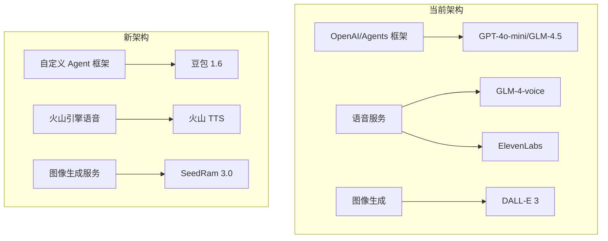

### 2.2 升级后架构

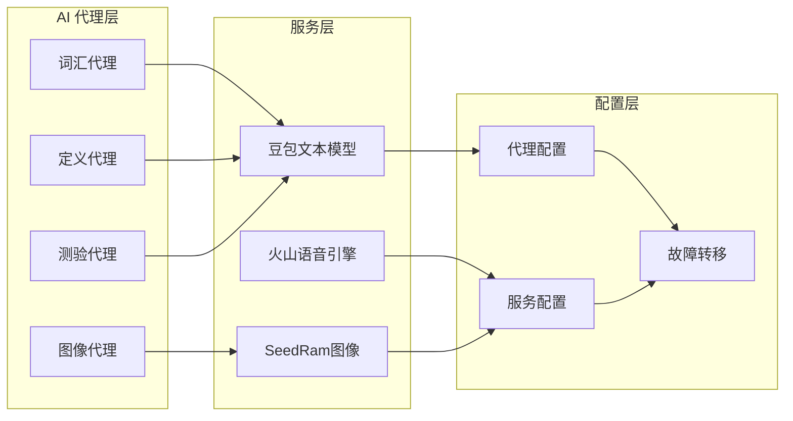

## 3. 技术实现方案

### 3.1 豆包文本模型集成

#### 3.1.1 模型配置

豆包 1.6 模型将作为主要文本生成服务，采用火山引擎 API 接口规范：

- **API 端点**：`https://ark.cn-beijing.volces.com/api/v3/chat/completions`
- **模型标识**：`ep-20250101-xxxxx`（豆包 1.6 端点）
- **认证方式**：Bearer Token

#### 3.1.2 API 配置结构

```typescript
interface DoubaoConfig {
  apiKey: string;
  baseUrl: string;
  endpoint: string;
  model: string;
  region: 'cn-beijing' | 'us-east-1';
}

const DOUBAO_CONFIG: DoubaoConfig = {
  apiKey: process.env.DOUBAO_API_KEY,
  baseUrl: 'https://ark.cn-beijing.volces.com/api/v3',
  endpoint: process.env.DOUBAO_ENDPOINT,
  model: 'doubao-pro-32k',
  region: 'cn-beijing'
};
```

#### 3.1.3 服务适配器

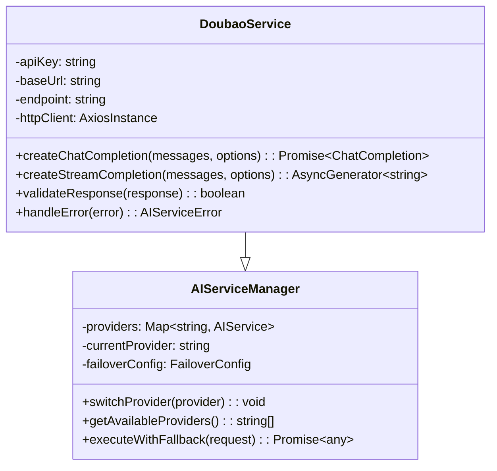

### 3.2 自定义 Agent 框架替换

#### 3.2.1 框架迁移策略

当前项目已有 `CustomAgent` 类基础，需要增强以完全替代 `@openai/agents`：

```typescript
interface CustomAgentConfig<TOutput> {
  name: string;
  instructions: string;
  outputSchema?: ZodSchema<TOutput>;
  modelProvider: 'doubao' | 'glm' | 'qwen';
  temperature?: number;
  maxTokens?: number;
  tools?: AgentTool[];
}

class EnhancedCustomAgent<TOutput = any> {
  private config: CustomAgentConfig<TOutput>;
  private aiService: DoubaoService;
  
  constructor(config: CustomAgentConfig<TOutput>) {
    this.config = config;
    this.aiService = new DoubaoService();
  }
  
  async run(input: string, context?: any): Promise<AgentResult<TOutput>> {
    // 实现完整的代理执行逻辑
  }
}
```

#### 3.2.2 代理迁移计划

| 原代理 | 迁移策略 | 优先级 |
|--------|----------|---------|
| vocabulary-agent | 直接迁移至豆包1.6 | 高 |
| definition-agent | 直接迁移至豆包1.6 | 高 |
| quiz-agent | 直接迁移至豆包1.6 | 高 |
| examples-agent | 直接迁移至豆包1.6 | 中 |
| image-generation-agent | 迁移至SeedRam3.0 | 中 |
| language-validation-agent | 直接迁移至豆包1.6 | 低 |

### 3.3 火山引擎语音服务集成

#### 3.3.1 语音服务架构

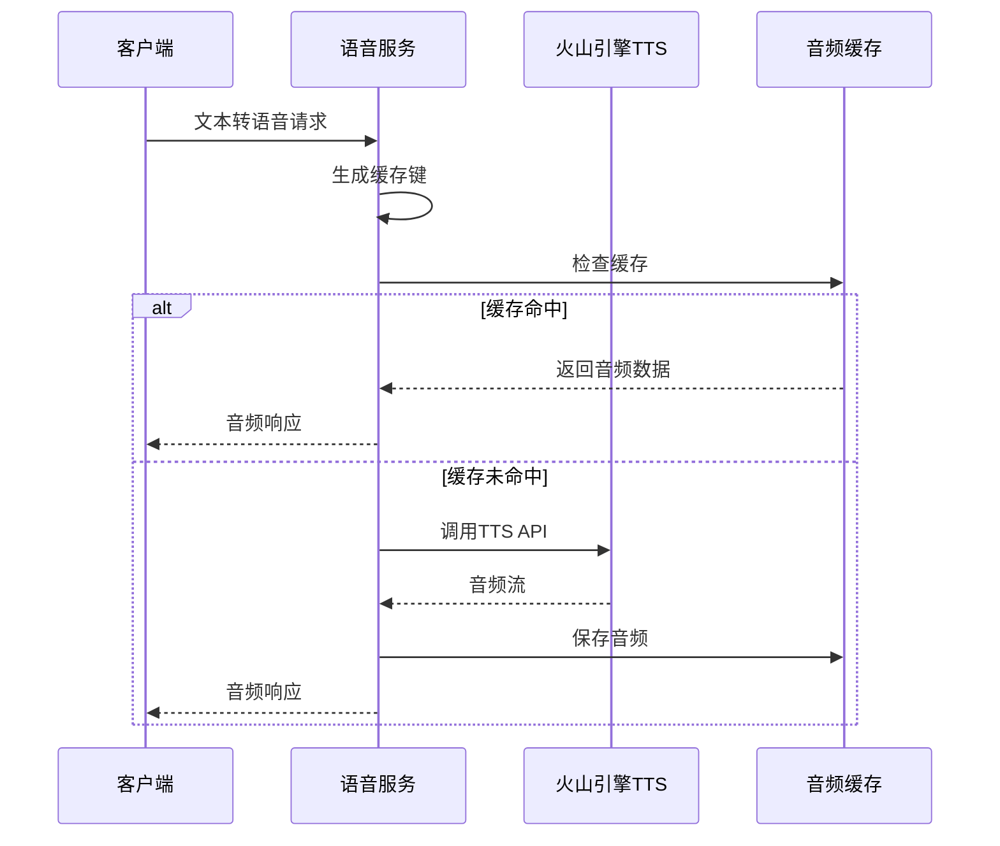

#### 3.3.2 火山引擎 TTS 配置

```typescript
interface VolcengineTTSConfig {
  appId: string;
  accessToken: string;
  cluster: 'volcano_tts';
  voiceType: string;
  encoding: 'mp3' | 'wav' | 'pcm';
  sampleRate: 16000 | 24000;
}

const VOLCENGINE_TTS_CONFIG: VolcengineTTSConfig = {
  appId: process.env.VOLCENGINE_APP_ID,
  accessToken: process.env.VOLCENGINE_ACCESS_TOKEN,
  cluster: 'volcano_tts',
  voiceType: 'BV001_streaming',
  encoding: 'mp3',
  sampleRate: 24000
};
```

#### 3.3.3 语音服务实现

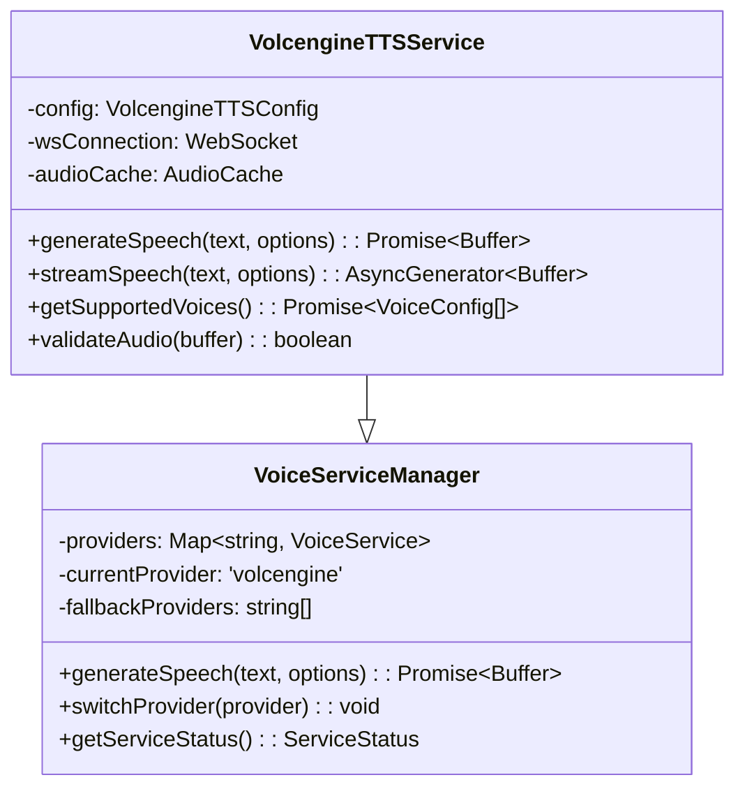

### 3.4 SeedRam 3.0 图像生成集成

#### 3.4.1 图像生成服务架构

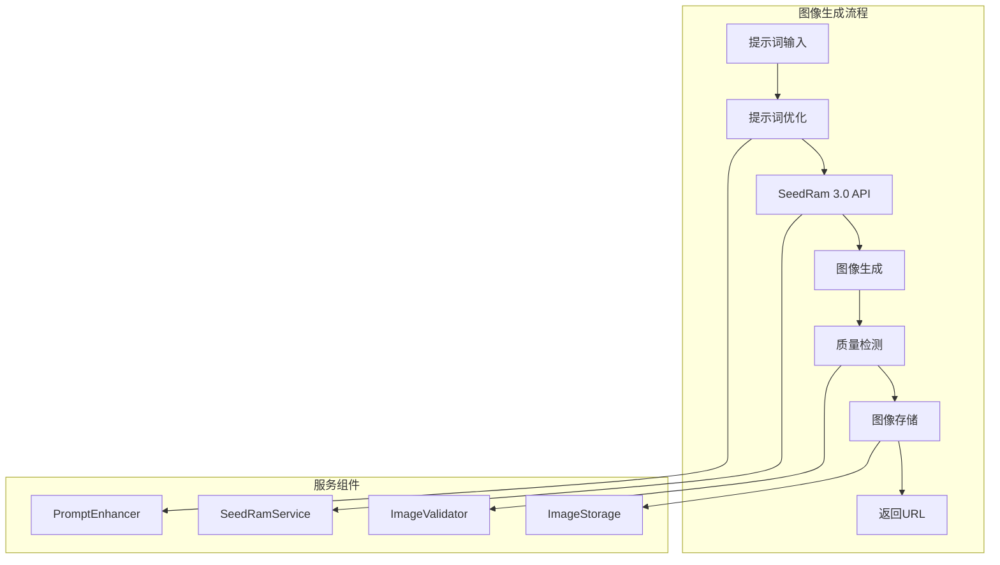

#### 3.4.2 SeedRam API 配置

```typescript
interface SeedRamConfig {
  apiKey: string;
  baseUrl: string;
  model: 'seedram-3.0';
  maxRetries: number;
  timeoutMs: number;
}

const SEEDRAM_CONFIG: SeedRamConfig = {
  apiKey: process.env.SEEDRAM_API_KEY,
  baseUrl: 'https://api.seedram.com/v1',
  model: 'seedram-3.0',
  maxRetries: 3,
  timeoutMs: 30000
};
```

#### 3.4.3 图像生成实现

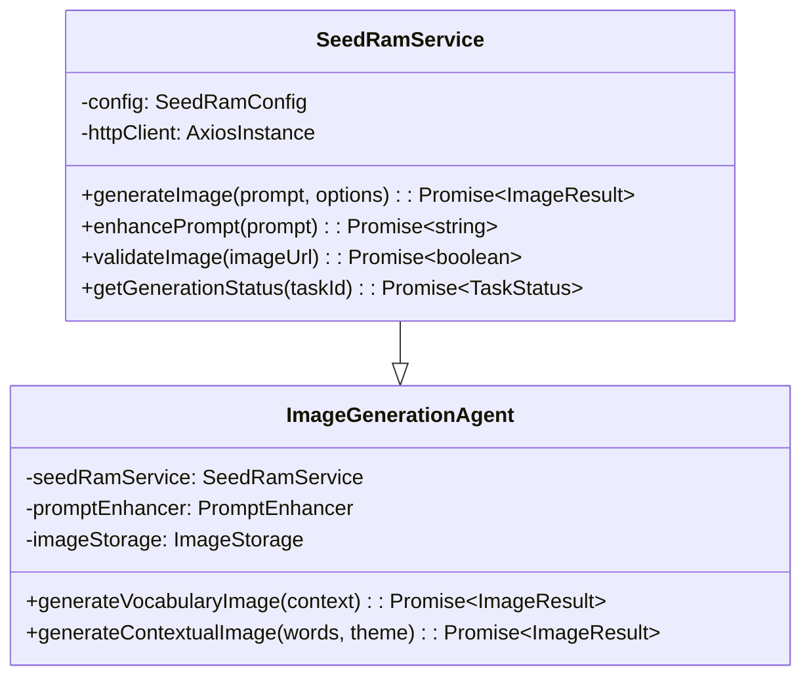

## 4. 数据流架构

### 4.1 整体数据流

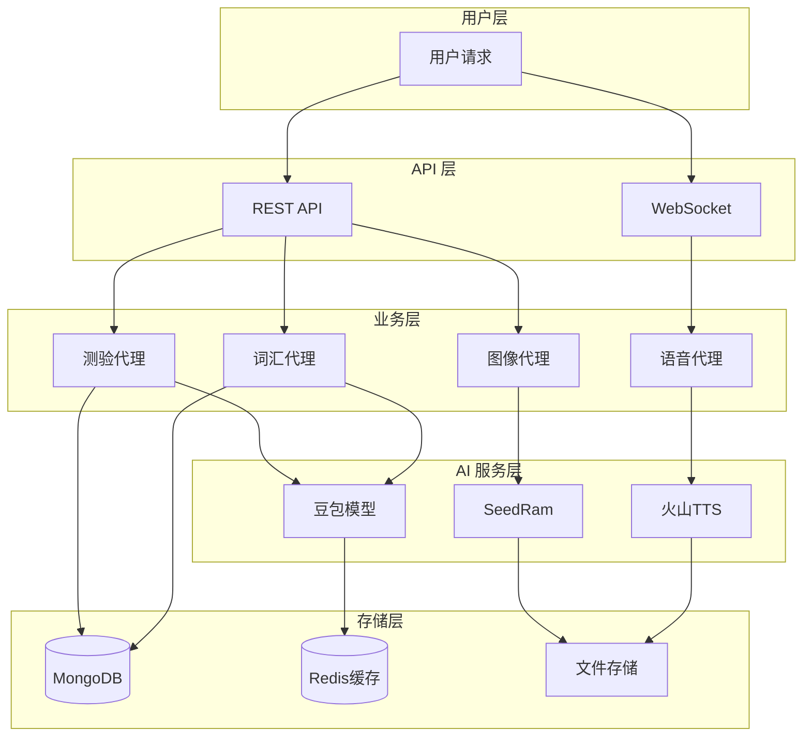

### 4.2 错误处理和故障转移

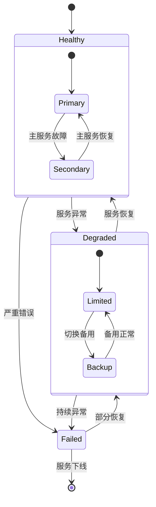

## 5. 配置管理体系

### 5.1 环境配置结构

```typescript
interface AIServiceEnvironment {
  // 豆包文本模型配置
  doubao: {
    apiKey: string;
    endpoint: string;
    model: string;
    region: 'cn-beijing' | 'us-east-1';
    maxTokens: number;
    temperature: number;
  };
  
  // 火山引擎语音配置
  volcengine: {
    appId: string;
    accessToken: string;
    cluster: string;
    voiceType: string;
    sampleRate: number;
  };
  
  // SeedRam 图像配置
  seedram: {
    apiKey: string;
    model: 'seedram-3.0';
    imageSize: '512x512' | '1024x1024';
    quality: 'standard' | 'hd';
  };
  
  // 服务故障转移配置
  failover: {
    retryAttempts: number;
    timeoutMs: number;
    cooldownMs: number;
    fallbackProviders: string[];
  };
}
```

### 5.2 服务注册表

| 服务类型 | 主服务 | 备用服务 | 故障转移策略 |
|----------|--------|----------|-------------|
| 文本生成 | 豆包1.6 | GLM-4.5 | 自动切换 |
| 语音合成 | 火山引擎 | - | 错误重试 |
| 图像生成 | SeedRam3.0 | - | 错误重试 |

## 6. 接口适配方案

### 6.1 豆包模型接口适配

```typescript
class DoubaoAPIAdapter {
  async chatCompletion(request: ChatCompletionRequest): Promise<ChatCompletionResponse> {
    const volcengineRequest = {
      model: this.config.endpoint,
      messages: request.messages,
      max_tokens: request.max_tokens,
      temperature: request.temperature,
      stream: request.stream || false
    };
    
    const response = await this.httpClient.post('/chat/completions', volcengineRequest);
    
    return this.transformResponse(response.data);
  }
  
  private transformResponse(volcResponse: any): ChatCompletionResponse {
    return {
      id: volcResponse.id,
      object: 'chat.completion',
      created: volcResponse.created,
      model: volcResponse.model,
      choices: volcResponse.choices.map(choice => ({
        index: choice.index,
        message: choice.message,
        finish_reason: choice.finish_reason
      })),
      usage: volcResponse.usage
    };
  }
}
```

### 6.2 火山引擎语音接口适配

```typescript
class VolcengineTTSAdapter {
  async textToSpeech(request: TTSRequest): Promise<TTSResponse> {
    const volcRequest = {
      app: {
        appid: this.config.appId,
        token: this.config.accessToken,
        cluster: this.config.cluster
      },
      user: {
        uid: request.userId || 'default'
      },
      audio: {
        voice_type: request.voice || 'BV001_streaming',
        encoding: request.format || 'mp3',
        speed_ratio: request.speed || 1.0,
        volume_ratio: request.volume || 1.0,
        pitch_ratio: request.pitch || 1.0
      },
      request: {
        reqid: this.generateRequestId(),
        text: request.text,
        text_type: 'plain',
        operation: 'query'
      }
    };
    
    const response = await this.sendTTSRequest(volcRequest);
    return this.processAudioResponse(response);
  }
}
```

### 6.3 SeedRam图像接口适配

```typescript
class SeedRamAPIAdapter {
  async generateImage(request: ImageGenerationRequest): Promise<ImageGenerationResponse> {
    const seedramRequest = {
      prompt: request.prompt,
      model: 'seedram-3.0',
      size: request.size || '1024x1024',
      quality: request.quality || 'standard',
      n: request.n || 1,
      response_format: 'url'
    };
    
    const response = await this.httpClient.post('/images/generations', seedramRequest);
    
    return {
      created: Date.now(),
      data: response.data.data.map(item => ({
        url: item.url,
        revised_prompt: item.revised_prompt
      }))
    };
  }
}
```

## 7. 性能优化策略

### 7.1 缓存策略

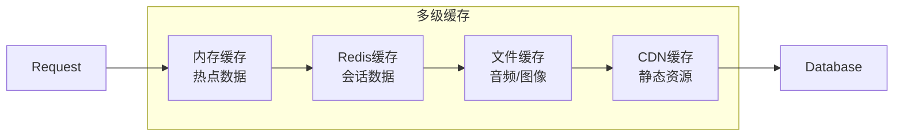

### 7.2 性能指标

| 指标类型 | 目标值 | 监控方式 |
|----------|--------|----------|
| 文本生成响应时间 | < 3秒 | APM监控 |
| 语音合成响应时间 | < 5秒 | 性能日志 |
| 图像生成响应时间 | < 30秒 | 异步任务 |
| 系统可用性 | > 99.5% | 健康检查 |
| 错误率 | < 1% | 错误统计 |

### 7.3 资源管理

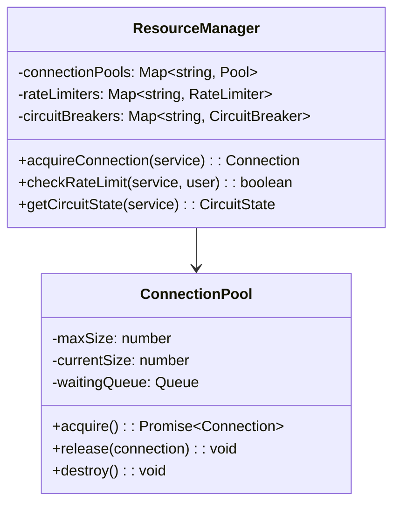

## 8. 测试策略

### 8.1 测试分层

```mermaid
pyramid
    title 测试金字塔
    bottom "单元测试<br/>组件逻辑测试"
    middle "集成测试<br/>服务接口测试"
    top "端到端测试<br/>用户场景测试"
```

### 8.2 测试覆盖范围

| 测试类型 | 覆盖内容 | 工具 |
|----------|----------|------|
| 单元测试 | 各服务适配器逻辑 | Jest |
| 集成测试 | API接口调用 | Supertest |
| 性能测试 | 响应时间和吞吐量 | Artillery |
| 故障测试 | 错误处理和恢复 | Chaos Monkey |

### 8.3 测试环境

```typescript
interface TestEnvironment {
  doubao: {
    mockEndpoint: string;
    testApiKey: string;
  };
  volcengine: {
    mockAppId: string;
    testToken: string;
  };
  seedram: {
    mockApiKey: string;
    testModel: string;
  };
}
```

## 9. 部署与运维

### 9.1 部署架构

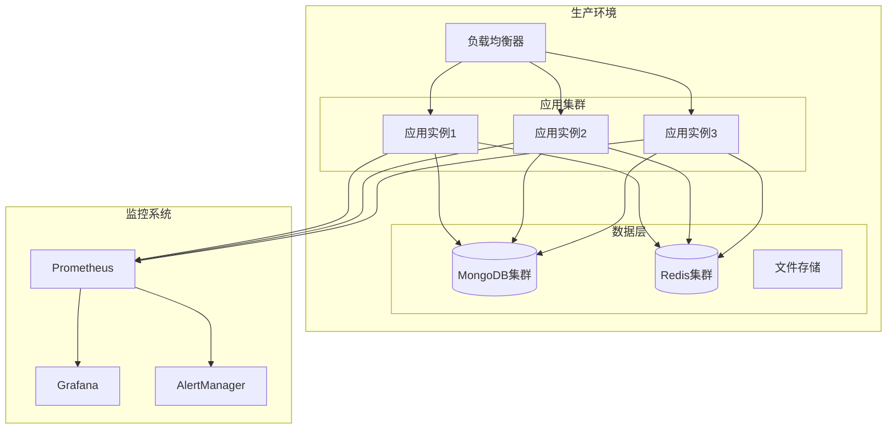

### 9.2 容器化配置

```dockerfile
# Dockerfile 示例
FROM node:18-alpine

WORKDIR /app

# 安装依赖
COPY package*.json ./
RUN npm ci --only=production

# 复制源码
COPY . .

# 编译TypeScript
RUN npm run build

# 健康检查
HEALTHCHECK --interval=30s --timeout=3s --start-period=5s --retries=3 \
  CMD curl -f http://localhost:3000/api/health || exit 1

EXPOSE 3000

CMD ["npm", "start"]
```

### 9.3 监控指标

```mermaid
dashboard
    title "系统监控面板"
    
    metric "API响应时间" {
        target: "< 3s"
        current: "2.1s"
        status: "healthy"
    }
    
    metric "错误率" {
        target: "< 1%"
        current: "0.3%"
        status: "healthy"
    }
    
    metric "服务可用性" {
        target: "> 99.5%"
        current: "99.8%"
        status: "healthy"
    }
    
    metric "资源使用率" {
        target: "< 80%"
        current: "65%"
        status: "healthy"
    }
```

## 10. 风险评估与应对

### 10.1 技术风险

| 风险类型 | 影响程度 | 概率 | 应对策略 |
|----------|----------|------|----------|
| API变更 | 高 | 中 | 版本锁定+适配层 |
| 服务限流 | 中 | 高 | 配额管理+降级 |
| 性能下降 | 中 | 中 | 性能监控+优化 |
| 数据丢失 | 高 | 低 | 备份策略+恢复 |

### 10.2 业务风险

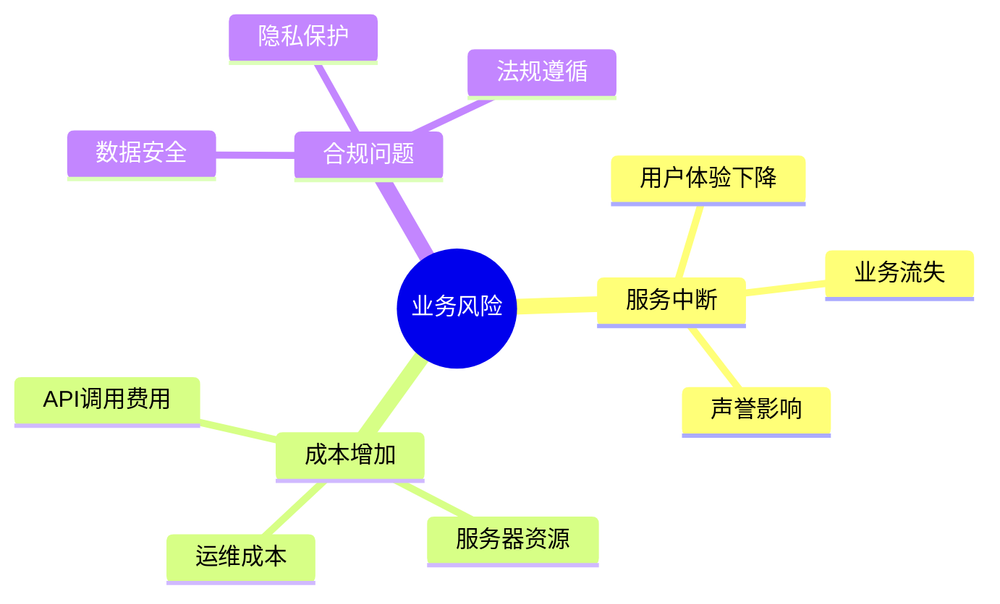

### 10.3 应急预案

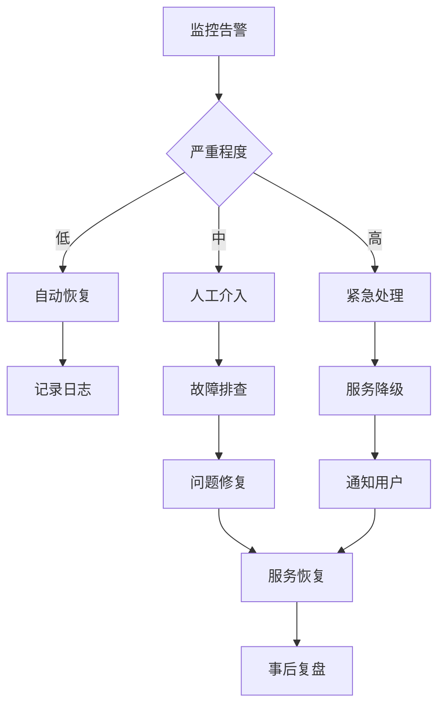

## 11. 迁移路线图

### 11.1 分阶段实施

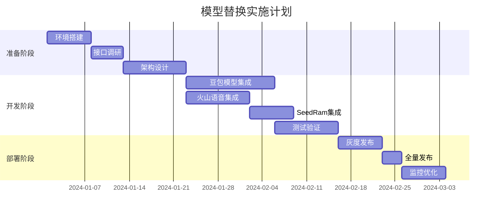

### 11.2 里程碑检查点

| 阶段 | 里程碑 | 验收标准 | 负责人 |
|------|--------|----------|--------|
| 准备 | 技术方案确认 | 架构评审通过 | 架构师 |
| 开发 | 核心功能完成 | 单元测试覆盖率>80% | 开发团队 |
| 测试 | 集成测试完成 | 所有用例通过 | 测试团队 |
| 部署 | 生产环境上线 | 服务稳定运行7天 | 运维团队 |
