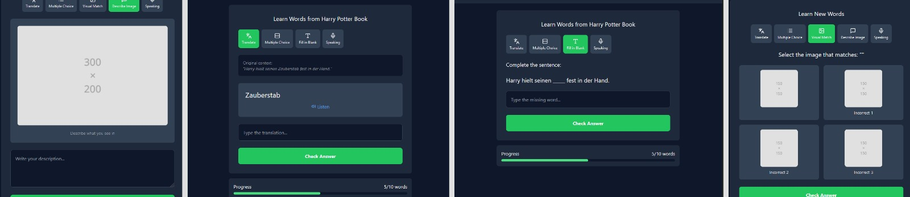

# WordPecker App

A personalized language-learning app that brings the magic of Duolingo-style lessons to your own curated vocabulary lists and contexts.

## The Idea

Learning a new language can be straightforward, but mastering it is the real challenge. While it's relatively easy to grasp the basics, developing strong communication or reading skills depends on having a solid vocabulary. To build this, you must learn words and phrases at various levels, yet exposure is key. For instance, if you've studied English but don’t live in an English-speaking country, advancing your skills becomes significantly harder. You can read books, watch movies, or browse blogs, but fully immersing yourself in the language is still difficult. Real progress often requires extra effort—studying and revisiting words and phrases encountered in your daily life.

However, this process can be inconvenient. You have to pause whatever you’re doing to note new words, search their meanings, record them, and then review them later. This is time-consuming and tiring. As a result, although you might improve, the learning process can feel painfully slow and inefficient.

To solve this, I have an idea for an app that merges personalized learning with the efficiency of flashcards—a blend of Duolingo-like lessons and custom study lists.

Imagine you’re reading a book—say, Harry Potter. As you come across unfamiliar words, you open the app and create a new list with details like:

- Name: Harry Potter Book
- Description: The first book in the series
- Context: Harry Potter

Once the list is created, you add the words or phrases you’ve found. The app automatically provides their meanings in context after you save them, so you can continue reading without interruption.

Later, you revisit the list and pick one of two options: Learn or Quiz.

- Learn: This mode delivers structured lessons in a Duolingo style. Text, visuals, and exercises are dynamically generated using LLMs.

**Note**: Text-based multiple-choice questions are _currently_ the only question type available.

- Quiz: When you’re ready, you can test what you’ve learned through interactive quizzes. They’re engaging and gamified, awarding points and showing your progress. For example, it might indicate you’ve mastered 75% of your list.

**Note**: The feature that displays something like “You’ve mastered 75% of your list” is planned but not yet built.

The key advantage is that the app keeps your learning tied to the context in which you originally saw the words. By returning to them in their original setting, you strengthen those specific neural pathways, speeding up retention and making learning significantly more effective.

**In short, it’s like having a personalized Duolingo where you can create and learn from your own lists. It’s a powerful way to immerse yourself in the language and make steady progress.**


## How It Works

1. **Encounter New Words**: While reading or watching something, open the app and add new words or phrases to a contextual list (e.g., Harry Potter Book, Science Blog, Netflix Show, etc.).
2. **Automatic Definitions**: The app automatically fetches the word definitions (in the context) after you save them.
3. **Learn**: Dive into Learn Mode, practice exercises—just like Duolingo, but tailored to your words.
4. **Quiz**: Switch to Quiz Mode anytime to check your retention.
5. **Review and Repeat**: Visit your lists.

## Demo

[](https://www.youtube.com/watch?v=QIwPGAXgNLU)

### Create List & Add Word

[](https://www.youtube.com/watch?v=t1U5vzm5Qw0)


## Roadmap

- **Additional Question Types**: Currently, only text-based multiple-choice questions are supported. In the future, I plan to introduce more Duolingo-style exercises such as fill-in-the-blanks, listening comprehension, and visual matching.



- **Progress Tracking**: Display detailed statistics—like a mastery percentage—and possibly introduce daily goals or streaks to keep learners motivated.

- **List Sharing**: Allow users to share their custom vocabulary lists with others.

- **Improved Onboarding**: Provide a quick tutorial or sample list for new users, helping them understand the app’s features and workflow more easily.

- **Integration with Other Platforms**: Connecting with e-readers?, browsers, or note-taking apps so users can add new words without leaving those platforms.

## Getting Started

### Prerequisites

- Node.js >= 16
- npm or yarn
- A Supabase account
- An OpenAI API key

### Installation

Clone the repository:
```bash
git clone https://github.com/baturyilmaz/wordpecker-app.git
cd wordpecker-app
```

Install dependencies:
```bash
# Install backend dependencies
cd backend
npm install

# Install frontend dependencies
cd frontend
npm install
```

### Configuration

Create `.env` files:

Backend `.env`:
```
PORT=
OPENAI_API_KEY=
SUPABASE_URL=
SUPABASE_SERVICE_KEY=
```

Frontend `.env`:
```
VITE_SUPABASE_URL=
VITE_SUPABASE_ANON_KEY=
VITE_API_URL=
```

### Development

Start the backend:
```bash
cd backend
npm run dev
```

Start the frontend:
```bash
cd frontend
npm run dev
```

## Architecture

- Frontend: React.js with TypeScript
- Backend: Express.js
- Database: Supabase (PostgreSQL)
- Auth: Supabase Auth
- AI: OpenAI API

## Contributing

Contributions are welcome!

1. Fork the repo
2. Create a feature branch
3. Commit changes
4. Push to your branch
5. Open a pull request

## License

[MIT](LICENSE)
