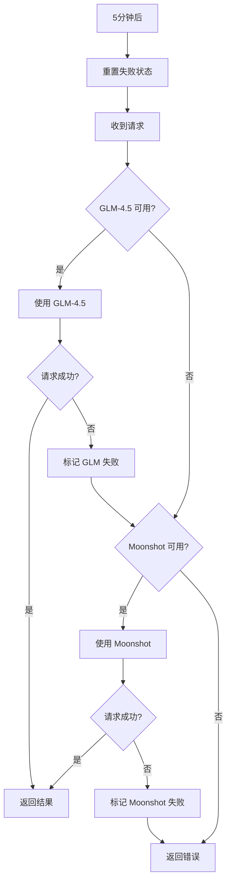

# WordPecker AI 服务冗余机制

## 🎯 概述

WordPecker 现已集成智能 AI 服务冗余机制，确保业务连续性：

- **主要服务**: GLM-4.5 (智谱AI) - 优先使用
- **备选服务**: Moonshot AI - 自动故障转移
- **语音服务**: GLM-4-voice (主) + ElevenLabs (备)
- **自动恢复**: 5分钟冷却期后自动重试失败服务

## 🚀 快速开始

### 1. 环境配置

复制并配置环境变量：

```bash
cp .env.example .env
```

在 `.env` 文件中配置以下密钥：

```bash
# GLM (智谱AI) - 主要服务
GLM_API_KEY=your_glm_api_key_here
GLM_BASE_URL=https://open.bigmodel.cn/api/paas/v4
GLM_TEXT_MODEL=glm-4.5
GLM_VOICE_MODEL=glm-4-voice

# Moonshot AI - 备选服务
MOONSHOT_API_KEY=your_moonshot_api_key_here
MOONSHOT_BASE_URL=https://api.moonshot.cn/v1
MOONSHOT_MODEL=moonshot-v1-8k

# 向后兼容 (使用 Moonshot)
OPENAI_API_KEY=your_moonshot_api_key_here
OPENAI_BASE_URL=https://api.moonshot.cn/v1
OPENAI_MODEL=moonshot-v1-8k
```

### 2. 获取 API 密钥

#### GLM (智谱AI)
1. 访问 [智谱AI开放平台](https://open.bigmodel.cn/)
2. 注册并登录账户
3. 在控制台创建 API 密钥
4. 复制密钥到 `GLM_API_KEY`

#### Moonshot AI
1. 访问 [Moonshot AI 平台](https://platform.moonshot.cn/)
2. 注册并登录账户
3. 在 API 密钥页面创建新密钥
4. 复制密钥到 `MOONSHOT_API_KEY`

### 3. 测试服务

运行冗余机制测试：

```bash
npm run test:ai-redundancy
```

预期输出：
```
🚀 WordPecker AI 服务冗余机制测试
=====================================

🤖 测试 AI 文本生成服务冗余机制...

初始服务状态: {
  当前提供商: 'glm',
  可用提供商: [ 'glm', 'moonshot' ],
  失败提供商: []
}

📝 发送测试请求...
✅ AI 请求成功!
⏱️  响应时间: 1234ms
📊 使用的模型: glm-4.5
💬 响应内容: 你好！我是一个AI助手...
🔢 Token 使用: 45

🎵 测试语音生成服务冗余机制...
✅ 语音生成成功!
📦 音频大小: 12345 bytes

🎉 所有服务测试通过！冗余机制工作正常。
```

## 📊 服务监控

### 实时状态查询

```bash
# 获取所有服务状态
curl http://localhost:3000/api/service/status

# 健康检查
curl http://localhost:3000/api/service/health
```

### 状态重置

```bash
# 重置 AI 服务失败状态
curl -X POST http://localhost:3000/api/service/ai/reset \
  -H "Content-Type: application/json" \
  -d '{"provider": "glm"}'

# 重置语音服务失败状态
curl -X POST http://localhost:3000/api/service/voice/reset
```

## 💻 代码使用

### AI 文本生成 (推荐方式)

```typescript
import { createChatCompletion } from '../config/ai-service';

// 自动使用 GLM-4.5，失败时切换到 Moonshot
const response = await createChatCompletion([
  { role: 'user', content: '你好，请介绍一下自己。' }
], {
  temperature: 0.7,
  max_tokens: 1000
});

console.log(response.choices[0].message.content);
```

### 语音生成

```typescript
import { generateSpeech } from '../config/voice-service';

// 自动使用 GLM-4-voice，失败时切换到 ElevenLabs
const audioBuffer = await generateSpeech('你好，世界！', {
  voice: 'alloy',
  speed: 1.0,
  format: 'mp3'
});

// 保存或返回音频数据
fs.writeFileSync('output.mp3', audioBuffer);
```

### 服务状态查询

```typescript
import { getAIServiceStatus, getVoiceServiceStatus } from '../config/ai-service';

const aiStatus = getAIServiceStatus();
const voiceStatus = getVoiceServiceStatus();

console.log('AI 服务状态:', {
  当前提供商: aiStatus.currentProvider,
  可用服务: aiStatus.availableProviders,
  失败服务: aiStatus.failedProviders
});
```

## 🔧 故障排除

### 常见问题

#### 1. 所有服务都不可用
```bash
# 检查 API 密钥
echo $GLM_API_KEY
echo $MOONSHOT_API_KEY

# 检查网络连接
curl -I https://open.bigmodel.cn/api/paas/v4
curl -I https://api.moonshot.cn/v1

# 查看详细日志
tail -f logs/app.log | grep "AI 服务"
```

#### 2. 频繁切换服务
```bash
# 检查 API 配额
curl -H "Authorization: Bearer $GLM_API_KEY" \
  https://open.bigmodel.cn/api/paas/v4/quota

# 重置失败状态
curl -X POST http://localhost:3000/api/service/ai/reset
```

#### 3. 某个服务一直失败
```bash
# 手动测试 GLM API
curl -X POST https://open.bigmodel.cn/api/paas/v4/chat/completions \
  -H "Authorization: Bearer $GLM_API_KEY" \
  -H "Content-Type: application/json" \
  -d '{
    "model": "glm-4.5",
    "messages": [{"role": "user", "content": "Hello"}]
  }'

# 手动测试 Moonshot API
curl -X POST https://api.moonshot.cn/v1/chat/completions \
  -H "Authorization: Bearer $MOONSHOT_API_KEY" \
  -H "Content-Type: application/json" \
  -d '{
    "model": "moonshot-v1-8k",
    "messages": [{"role": "user", "content": "Hello"}]
  }'
```

## 📈 性能优化

### 1. 连接池配置
服务自动管理连接池，无需额外配置。

### 2. 缓存策略
失败的服务会被缓存5分钟，避免重复尝试。

### 3. 监控告警
建议设置监控告警：

```bash
#!/bin/bash
# health-check.sh
HEALTH_URL="http://localhost:3000/api/service/health"
if ! curl -f $HEALTH_URL > /dev/null 2>&1; then
  echo "AI 服务异常！" | mail -s "WordPecker 告警" admin@example.com
fi
```

添加到 crontab：
```bash
# 每5分钟检查一次
*/5 * * * * /path/to/health-check.sh
```

## 🔄 故障转移流程



## 📝 更新日志

### v1.0.0 (2024-01-01)
- ✨ 新增 GLM-4.5 和 Moonshot AI 冗余机制
- ✨ 新增 GLM-4-voice 语音服务支持
- ✨ 新增服务状态监控 API
- ✨ 新增自动故障转移和恢复机制
- 📚 完善文档和测试脚本

## 🤝 贡献

如果你发现问题或有改进建议，请：

1. 查看现有 [Issues](https://github.com/your-repo/issues)
2. 创建新的 Issue 描述问题
3. 提交 Pull Request

## 📄 许可证

MIT License - 详见 [LICENSE](LICENSE) 文件。