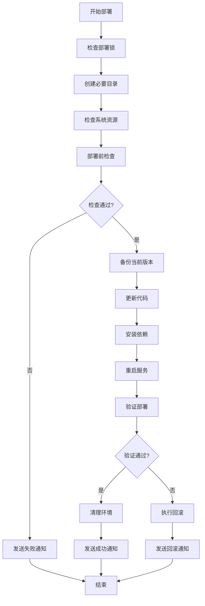

# WordPecker 自动化部署指南

## 概述

本指南介绍如何使用 WordPecker 的自动化部署系统，实现代码更新、依赖安装、备份回滚和状态监控的完整自动化流程。

## 部署脚本架构

```
scripts/
├── deploy.sh                    # 主部署脚本
├── pre-deploy-check.sh         # 部署前环境检查
├── post-deploy-verify.sh       # 部署后验证
├── quick-deploy.sh             # 一键部署脚本
├── deploy-config.sh            # 部署配置管理
└── deploy-notifications.sh     # 部署通知系统
```

## 快速开始

### 1. 环境准备

确保以下环境变量已设置：

```bash
# 必需的环境变量
export OPENAI_API_KEY="your-openai-api-key"
export MONGODB_URL="your-mongodb-connection-string"

# 可选的环境变量
export ELEVENLABS_API_KEY="your-elevenlabs-api-key"
export PEXELS_API_KEY="your-pexels-api-key"
export NODE_ENV="production"
```

### 2. 一键部署

```bash
# 完整部署流程（推荐）
./scripts/quick-deploy.sh

# 仅检查环境
./scripts/quick-deploy.sh --check-only

# 跳过检查直接部署
./scripts/quick-deploy.sh --skip-check

# 强制部署（忽略某些错误）
./scripts/quick-deploy.sh --force

# 清理安装
./scripts/quick-deploy.sh --clean
```

### 3. 分步部署

如果需要更精细的控制，可以分步执行：

```bash
# 步骤1: 部署前检查
./scripts/pre-deploy-check.sh

# 步骤2: 执行部署
./scripts/deploy.sh

# 步骤3: 部署后验证
./scripts/post-deploy-verify.sh
```

## 详细功能说明

### 部署前检查 (pre-deploy-check.sh)

自动检查部署环境的各个方面：

- **系统环境**: 操作系统、用户权限、工作目录
- **Node.js环境**: Node.js版本、npm版本、PM2安装
- **项目结构**: 关键目录和文件完整性
- **环境变量**: 必需和可选的环境变量配置
- **系统资源**: 磁盘空间、内存使用、CPU负载
- **网络连接**: 基本网络、GitHub、npm registry连接
- **数据库连接**: MongoDB连接测试
- **外部API**: OpenAI、ElevenLabs、Pexels API连接测试

```bash
# 运行检查并查看详细报告
./scripts/pre-deploy-check.sh
cat ./logs/check-results.json
```

### 主部署脚本 (deploy.sh)

执行完整的部署流程：

#### 主要功能

1. **备份机制**
   - 自动备份当前版本
   - 保留最近10个备份
   - 记录Git提交信息和系统状态

2. **代码更新**
   - Git代码拉取和更新
   - 处理未提交的更改
   - 显示更新内容摘要

3. **依赖管理**
   - 后端和前端依赖安装
   - 支持清理安装模式
   - 自动构建前端应用

4. **服务管理**
   - PM2进程重启和管理
   - 服务启动状态监控
   - 自动保存PM2配置

5. **回滚机制**
   - 部署失败自动回滚
   - 恢复文件和Git状态
   - 重新安装依赖和重启服务

#### 使用示例

```bash
# 标准部署
./scripts/deploy.sh

# 清理安装
./scripts/deploy.sh --clean

# 强制部署
./scripts/deploy.sh --force

# 仅测试模式
./scripts/deploy.sh --test-only

# 回滚到指定备份
./scripts/deploy.sh --rollback /home/devbox/backups/wordpecker-20240101-120000

# 详细输出模式
./scripts/deploy.sh --verbose
```

### 部署后验证 (post-deploy-verify.sh)

验证部署结果和服务状态：

#### 验证项目

1. **PM2进程状态**: 检查进程运行状态、内存使用、重启次数
2. **服务可访问性**: 等待服务启动并测试连接
3. **API端点功能**: 测试健康检查、就绪检查和关键API
4. **前端功能**: 验证页面加载和静态资源
5. **数据库连接**: 通过API验证数据库连接状态
6. **性能测试**: API响应时间、前端加载时间、并发处理
7. **日志记录**: 检查PM2日志和应用日志

```bash
# 运行验证并查看报告
./scripts/post-deploy-verify.sh
cat ./logs/verify-results.json
```

### 配置管理 (deploy-config.sh)

统一管理部署相关配置：

```bash
# 显示当前配置
./scripts/deploy-config.sh show

# 验证配置
./scripts/deploy-config.sh validate

# 初始化配置（创建目录、设置日志轮转）
./scripts/deploy-config.sh init
```

#### 主要配置项

- **项目配置**: 名称、版本、目录路径
- **服务配置**: 端口、URL、超时设置
- **PM2配置**: 应用名称、内存限制、重启策略
- **监控配置**: 健康检查间隔、资源阈值
- **日志配置**: 保留天数、文件大小限制

### 通知系统 (deploy-notifications.sh)

发送部署状态通知和告警：

#### 支持的通知渠道

- **系统日志**: 记录到系统日志和文件
- **邮件通知**: 发送详细的部署报告邮件
- **Slack通知**: 发送格式化的Slack消息
- **Webhook通知**: 发送JSON格式的状态数据
- **桌面通知**: 本地桌面通知（如果支持）

#### 使用示例

```bash
# 发送自定义通知
./scripts/deploy-notifications.sh send SUCCESS "部署完成"

# 发送预定义通知
./scripts/deploy-notifications.sh start "快速部署"
./scripts/deploy-notifications.sh success "5分30秒"
./scripts/deploy-notifications.sh failure "数据库连接失败" "验证阶段"

# 发送告警
./scripts/deploy-notifications.sh health "backend" "unhealthy"
./scripts/deploy-notifications.sh resource "memory" "85%" "80%"

# 测试通知功能
./scripts/deploy-notifications.sh test
```

#### 配置通知渠道

```bash
# 邮件通知
export DEPLOY_EMAIL="admin@example.com"

# Slack通知
export SLACK_WEBHOOK_URL="https://hooks.slack.com/services/..."

# 自定义Webhook
export DEPLOY_WEBHOOK_URL="https://your-monitoring-system.com/webhook"
```

## 部署流程详解

### 完整部署流程



### 错误处理和回滚

1. **自动回滚触发条件**:
   - 代码更新失败
   - 依赖安装失败
   - 服务启动失败
   - 部署验证失败

2. **回滚过程**:
   - 停止当前服务
   - 恢复备份文件
   - 重置Git状态
   - 重新安装依赖
   - 重启服务
   - 验证回滚结果

3. **回滚验证**:
   - 服务健康检查
   - API功能测试
   - 前端访问测试

## 监控和维护

### 日志文件位置

```
logs/
├── deploy.log                  # 主部署日志
├── pre-deploy-check.log       # 部署前检查日志
├── post-deploy-verify.log     # 部署后验证日志
├── quick-deploy.log           # 快速部署日志
├── deploy-notifications.log   # 通知系统日志
├── check-results.json         # 检查结果报告
├── verify-results.json        # 验证结果报告
└── deploy-report-*.json       # 部署报告
```

### 备份管理

```bash
# 查看备份列表
ls -la /home/devbox/backups/

# 手动回滚到指定备份
./scripts/deploy.sh --rollback /home/devbox/backups/wordpecker-20240101-120000

# 清理旧备份（保留最近10个）
find /home/devbox/backups -name "wordpecker-*" -type d | sort -r | tail -n +11 | xargs rm -rf
```

### 健康检查

```bash
# 检查服务状态
pm2 status

# 查看服务日志
pm2 logs

# 手动健康检查
curl http://localhost:3000/api/health
curl http://localhost:3000/api/ready

# 检查前端服务
curl http://localhost:5173
```

### 性能监控

```bash
# 查看系统资源
htop
df -h
free -h

# 查看PM2监控
pm2 monit

# 查看网络连接
netstat -tuln | grep -E "3000|5173"
```

## 故障排除

### 常见问题

1. **部署前检查失败**
   - 检查环境变量设置
   - 确认网络连接正常
   - 验证API密钥有效性
   - 检查系统资源充足

2. **代码更新失败**
   - 检查Git仓库连接
   - 确认分支和权限
   - 处理合并冲突
   - 检查磁盘空间

3. **依赖安装失败**
   - 检查npm registry连接
   - 清理node_modules重新安装
   - 检查package.json语法
   - 确认Node.js版本兼容

4. **服务启动失败**
   - 检查端口占用情况
   - 查看PM2错误日志
   - 验证环境变量配置
   - 检查文件权限

5. **部署验证失败**
   - 等待服务完全启动
   - 检查防火墙设置
   - 验证数据库连接
   - 查看应用错误日志

### 调试技巧

```bash
# 启用详细输出
export DEBUG=true
./scripts/quick-deploy.sh --verbose

# 查看实时日志
tail -f ./logs/deploy.log

# 检查PM2进程详情
pm2 show wordpecker-backend
pm2 show wordpecker-frontend

# 测试API连接
curl -v http://localhost:3000/api/health

# 检查数据库连接
node -e "
const mongoose = require('./backend/node_modules/mongoose');
mongoose.connect(process.env.MONGODB_URL)
  .then(() => console.log('DB OK'))
  .catch(err => console.error('DB Error:', err));
"
```

## 最佳实践

### 部署前准备

1. **环境检查**: 始终运行部署前检查
2. **代码审查**: 确保代码质量和测试覆盖
3. **备份验证**: 确认备份机制正常工作
4. **资源监控**: 检查系统资源使用情况

### 部署过程

1. **分步部署**: 对于重要更新，考虑分步部署
2. **监控日志**: 实时监控部署过程日志
3. **验证测试**: 部署后立即进行功能验证
4. **回滚准备**: 准备好快速回滚方案

### 部署后维护

1. **性能监控**: 持续监控应用性能
2. **日志管理**: 定期清理和分析日志
3. **备份管理**: 定期清理旧备份文件
4. **安全更新**: 及时更新依赖和安全补丁

## 自动化集成

### Cron定时任务

```bash
# 编辑crontab
crontab -e

# 添加定时部署任务（每天凌晨2点）
0 2 * * * cd /home/devbox/wordpecker-app && ./scripts/quick-deploy.sh --quiet

# 添加健康检查任务（每5分钟）
*/5 * * * * cd /home/devbox/wordpecker-app && ./scripts/post-deploy-verify.sh > /dev/null 2>&1 || ./scripts/deploy-notifications.sh health "system" "unhealthy"
```

### Git Hooks集成

```bash
# 创建post-receive hook
cat > .git/hooks/post-receive << 'EOF'
#!/bin/bash
cd /home/devbox/wordpecker-app
./scripts/quick-deploy.sh --skip-check
EOF

chmod +x .git/hooks/post-receive
```

### CI/CD集成

```yaml
# GitHub Actions示例
name: Deploy to Sealos
on:
  push:
    branches: [main]
jobs:
  deploy:
    runs-on: ubuntu-latest
    steps:
      - name: Deploy to server
        run: |
          ssh user@server 'cd /home/devbox/wordpecker-app && ./scripts/quick-deploy.sh'
```

## 总结

WordPecker自动化部署系统提供了完整的部署解决方案，包括：

- ✅ **全面的环境检查**：确保部署环境满足要求
- ✅ **自动化备份回滚**：保障部署安全性
- ✅ **智能错误处理**：自动处理常见部署问题
- ✅ **详细的状态验证**：确保部署质量
- ✅ **多渠道通知系统**：及时了解部署状态
- ✅ **完整的日志记录**：便于问题排查和审计

通过使用这套自动化部署系统，可以大大提高部署效率，减少人为错误，确保WordPecker应用的稳定运行。